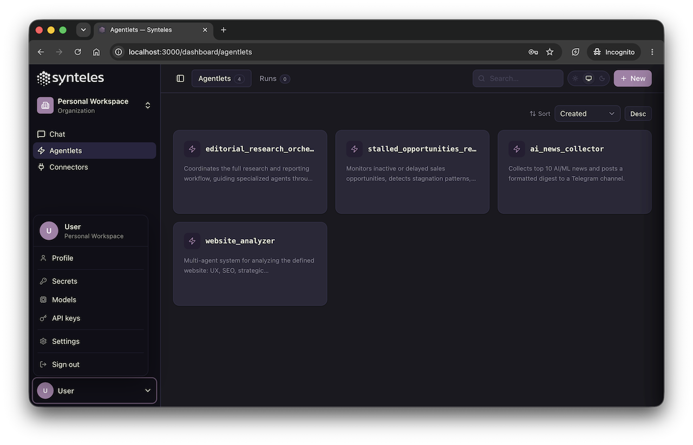
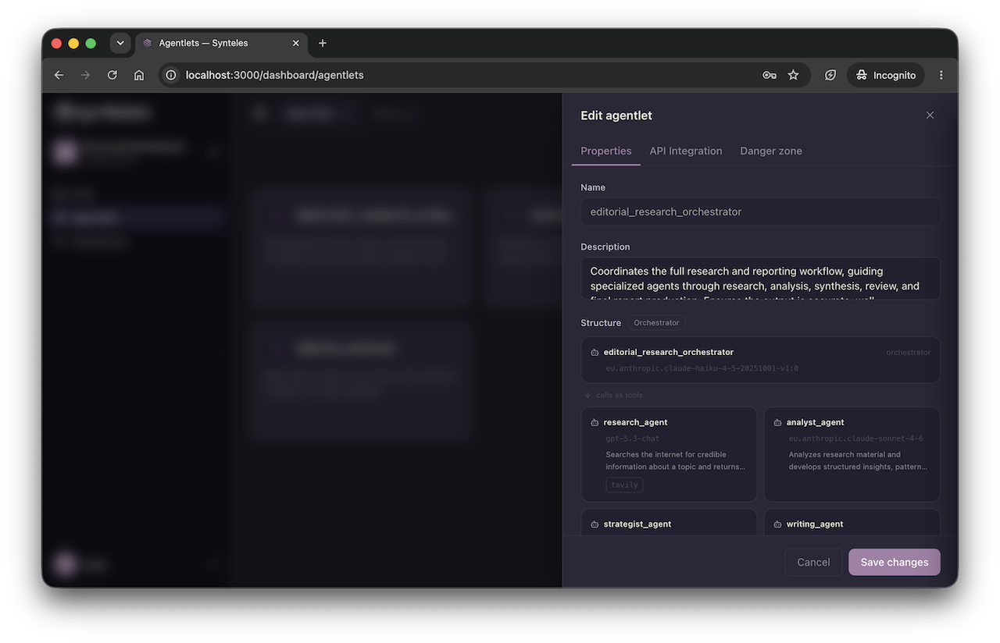
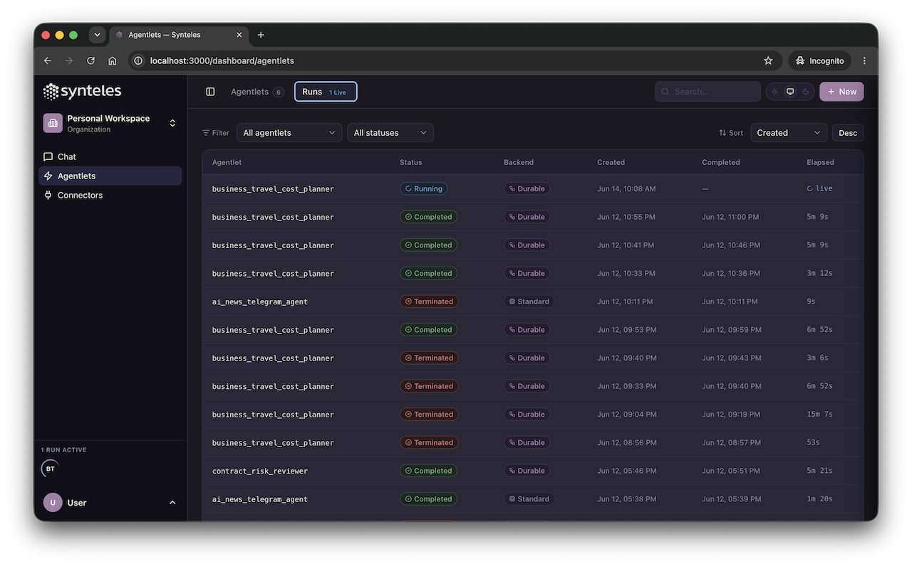
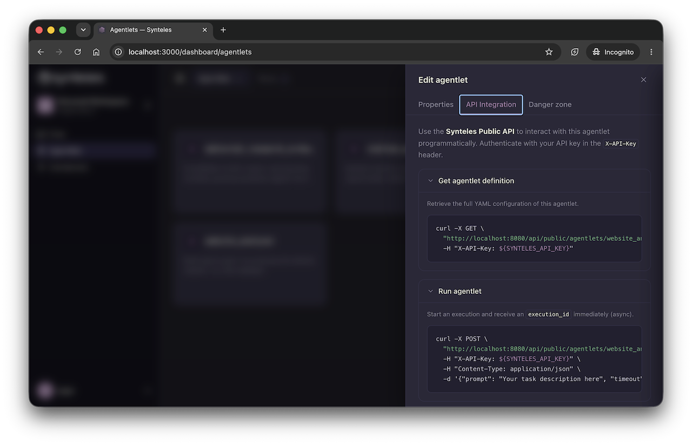
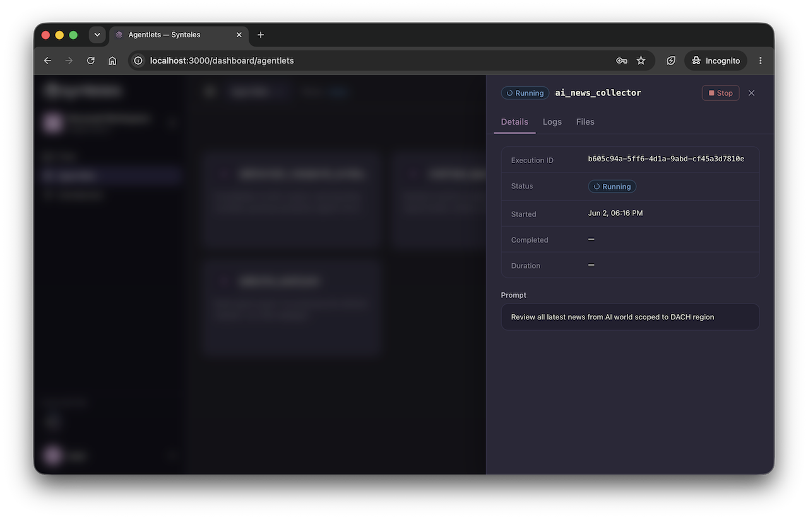

<p align="center">
  
</p>

# Synteles

[](https://github.com/Synteles/synteles/actions/workflows/ci.yml)
[](https://github.com/Synteles/synteles/actions/workflows/codeql.yml)
[](LICENSE)
[](https://github.com/Synteles/agentlet)

**Open-source platform for AI workers and enterprise workflows.**

Synteles is a platform for AI workers (agentlets) that execute workflows. Business users can describe tasks in plain language and Synteles creates and launches AI workers in minutes. Engineers can customize created AI workers using YAML DSL and then integrate them into existing systems via REST APIs and connectors. Runs on public cloud, on-premise, or air-gapped infrastructure.

⚠️ **Early Development**: Synteles is pre-v1.0. APIs and definitions and deployment structure may change.

**If you find this useful, please consider [starring this repository](https://github.com/Synteles/synteles) to help other developers discover it!** ⭐

## Screenshots

<table border="0" cellspacing="0" cellpadding="2">
  <tr>
    <td></td>
    <td></td>
  </tr>
  <tr>
    <td></td>
    <td></td>
  </tr>
  <tr>
    <td></td>
    <td></td>
  </tr>
</table>

## Quick Start

### Prerequisites

- [Docker](https://docs.docker.com/get-docker/) 24+ with Docker Compose v2
- ~5 GB free RAM for the full stack

### First-time setup

**1. Clone the repository**

```bash
git clone https://github.com/Synteles/synteles.git
cd synteles
```

**2. Run the install script**

```bash
bash install.sh
```

This walks you through selecting LLM providers, collecting credentials, and generates `.env` and `config/platform.toml`.

**3. Start the stack**

```bash
docker compose up -d
```

Docker Compose will:
- Start PostgreSQL and run database migrations
- Start MinIO and create the required buckets
- Start Keycloak and provision the realm, client, and default user
- Start the core and scheduler API services
- Start the web UI, synte service and API gateway (Traefik)

First boot takes approximately 60–90 seconds while Keycloak initializes. You can watch progress with:

```bash
docker compose logs -f
```

All services are ready when `docker compose ps` shows every container as `healthy` or `exited 0` (one-shot init containers).

**4. Open the UI**

```text
http://localhost:3000
```

Log in with the default credentials:

| Field    | Value      |
|----------|------------|
| Username | `synteles` |
| Password | `synteles` |

### Local consoles and endpoints

Once the stack is running, these URLs are available in your browser:

| Console / Service         | URL                                    | Login                          | What it's for                                      |
|---------------------------|----------------------------------------|--------------------------------|----------------------------------------------------|
| **Synteles UI**           | http://localhost:3000                  | `synteles` / `synteles`        | Main product console — manage agentlets, run executions, view conversations |
| **Keycloak Admin**        | http://localhost:8080/auth/admin       | `admin` / `admin`              | Identity provider — manage users, clients, and realm settings |
| **MinIO Console**         | http://localhost:9001                  | `minioadmin` / `minioadmin`    | Object storage — browse uploaded files, execution logs, and conversation blobs |
| **Traefik Dashboard**     | http://localhost:8081                  | _(no login)_                   | API gateway — inspect routing rules, service health, and middleware |
| **API (all routes)**      | http://localhost:8080                  | Bearer token or API key        | Entry point for all API calls (proxied via Traefik) |

> Default credentials are defined in `.env`. Change them before deploying outside of a local dev environment.

---

### Stop and start

**Stop the stack (data is preserved)**

```bash
docker compose down
```

PostgreSQL and MinIO data are stored in Docker named volumes (`postgres_data`, `minio_data`) and survive a `down`.

**Start again after a stop**

```bash
docker compose up -d
```

Keycloak re-imports the realm configuration on startup, but the provisioner script is idempotent — re-running is safe.

**Full reset (deletes all data)**

```bash
docker compose down -v
```

The `-v` flag removes the named volumes. The next `up` will run migrations and provisioning from scratch.

**Rebuild service images after a code change**

```bash
docker compose up -d --build
```

Only the services with changed Dockerfiles will be rebuilt.

---

### Configuration

There are two local configuration files, both git-ignored:

| File | Purpose |
|---|---|
| `.env` | Secrets and credentials (API keys, Keycloak passwords, encryption key) |
| `config/platform.toml` | Platform model configuration (chat model, platform default models) |

Both are generated by `install.sh`. To set up manually, copy the example and fill in your values:

```bash
cp .env.example .env
```

#### Chat engine model

The Synte chat assistant model is configured in `config/platform.toml` under the `[chat]` section:

```toml
[chat]
model_id    = "openai/gpt-4o"
secret_name = "openai"
```

`model_id` is a [LiteLLM-supported model string](https://docs.litellm.ai/docs/providers). `secret_name` references the matching `PLATFORM_SECRET_*` credential in `.env`. E.g. if secret_name is `openai`, then `PLATFORM_SECRET_OPENAI` defines the platform secret itself (see below the format of `PLATFORM_SECRET_*`).

#### Web search (Tavily)

Synteles uses web search capability for Synte assistant and newly created agentlets using Tavily and therefore needs a Tavily API key. Get a free key at [app.tavily.com](https://app.tavily.com). Once set, the key is automatically available to every agentlet — no per-agentlet configuration needed.

```env
TAVILY_API_KEY=tvly-...
```

#### Model credentials

All model credentials — for both the chat engine and platform default models — are configured the same way.

Each model entry in `config/platform.toml` has a `secret_name` field. Add a matching `PLATFORM_SECRET_<SECRET_NAME>` entry in `.env` with the provider credentials as a JSON object:

```env
PLATFORM_SECRET_OPENAI={"OPENAI_API_KEY": "sk-..."}
PLATFORM_SECRET_AZURE_AI={"AZURE_AI_API_KEY": "...", "AZURE_AI_API_BASE": "https://my-deployment.openai.azure.com"}
PLATFORM_SECRET_ANTHROPIC={"ANTHROPIC_API_KEY": "sk-ant-..."}
PLATFORM_SECRET_BEDROCK={"AWS_ACCESS_KEY_ID": "...", "AWS_SECRET_ACCESS_KEY": "...", "AWS_REGION_NAME": "eu-central-1"}
```

Models without a matching secret are silently skipped at execution time — the platform continues to work with whichever models are configured.

To add a new platform model or change its metadata (label, description, temperatures), edit `config/platform.toml` and restart the stack. See `config/platform.toml.example` for the format.

---

### Running integration tests

The integration test suite requires the full stack to be running.

```bash
cd tests/integration
uv sync
cp .env.example .env   # then fill in values
```

| Variable | Value (local dev defaults) |
|---|---|
| `API_BASE_URL` | `http://localhost:8080` |
| `OIDC_ISSUER_URL` | `http://localhost:8080/auth/realms/synteles` |
| `OIDC_CLIENT_ID` | `synteles-app` |
| `OIDC_CLIENT_SECRET` | `synteles-dev-secret` |
| `TEST_USER` | `synteles` |
| `TEST_USER_PASSWORD` | `synteles` |

Run all tests:

```bash
uv run pytest
```

## Repository Structure

```text
synteles/
  core-service/         # REST API — agentlets, users, secrets, files, org management
  scheduler-service/    # Execution engine — deploys and monitors agentlet containers (see Agentlet Runtime below)
  synte-service/        # Synte chat assistant — AI agent powering the chat UI
  ux-console/           # Web UI — Next.js frontend (App Router)
  platform-db/          # Shared database library (synteles_db) + Alembic migrations
  config/               # Runtime platform configuration (platform.toml)
  infra/                # Infrastructure definitions — Keycloak realm, Traefik routing
  docs/                 # Documentation
  tests/                # Integration test suite
  docker-compose.yml    # Local development environment
  install.sh            # First-time setup script
```

## Agentlet Runtime

Each agentlet execution runs inside an isolated Docker container using the [Synteles Agentlet](https://github.com/Synteles/agentlet) harness. The harness reads the agentlet's YAML definition, injects secrets, reads input files, runs the agent loop.

The default image is `synteles/agentlet:edge`. See the [Configuration](#configuration) section and [docs/configuration.md](docs/configuration.md) for how to pin a specific release tag via `AGENTLET_IMAGE`.

## Documentation

- [docs/architecture.md](docs/architecture.md) — system overview and component diagram
- [docs/api-contracts.md](docs/api-contracts.md) — API reference
- [docs/configuration.md](docs/configuration.md) — environment variable reference for all services
- [docs/testing.md](docs/testing.md) — unit and integration test guide

## Project Status

Synteles is in early development.

Not yet guaranteed:

- Stable APIs
- Backward-compatible workflow definitions
- Production-ready defaults
- Long-term support guarantees

**Agentlet image channel:** the default agentlet runtime image is `synteles/agentlet:edge`, which tracks the latest development build. For production use or reproducible deployments, pin a specific release tag by setting `AGENTLET_IMAGE` in your `.env`:

```env
AGENTLET_IMAGE=synteles/agentlet:1.2.3
```

Stable release tags are published alongside each GitHub release. See [docs/configuration.md](docs/configuration.md) for full details.

## Roadmap

Planned areas of work include:

- Governance, identity and access management enhancements
- Kubernetes deployment support (Helm charts) 
- Agentlet durable execution support
- Security hardening
- Agentlet versioning
- API stabilization

The roadmap may change based on user feedback and maintainer capacity.

## Contributing

Contributions are welcome.

Good first contribution areas include:

- Bug reports and reproducible issues
- Governance, identity and access management capabilities
- Kubernetes deployment support (Helm charts) 
- Security hardening
- Documentation improvements
- Tests


Please read:

- [CONTRIBUTING.md](CONTRIBUTING.md)
- [CODE_OF_CONDUCT.md](CODE_OF_CONDUCT.md)
- [SECURITY.md](SECURITY.md)
- [GOVERNANCE.md](GOVERNANCE.md)

Synteles uses the Developer Certificate of Origin. Contributions must be signed off.

## Responsible AI-Assisted Contributions

AI-assisted coding is allowed, but contributors remain responsible for the code they submit.

By contributing, you confirm that you understand, reviewed, tested, and have the right to submit your contribution under the project license.

See [CONTRIBUTING.md](CONTRIBUTING.md) for details.

## Security

Please do not report security vulnerabilities through public GitHub issues.

See [SECURITY.md](SECURITY.md) for reporting instructions.

## License

Synteles source code is licensed under the Apache License, Version 2.0.

See [LICENSE](LICENSE).

## Trademark and Brand

The Synteles name, logo, visual identity, and related brand assets are not licensed under Apache License 2.0.

See [TRADEMARKS.md](TRADEMARKS.md).

## Contact

- General: hello@synteles.io
- Security: security@synteles.io
- Legal / trademark: legal@synteles.io
