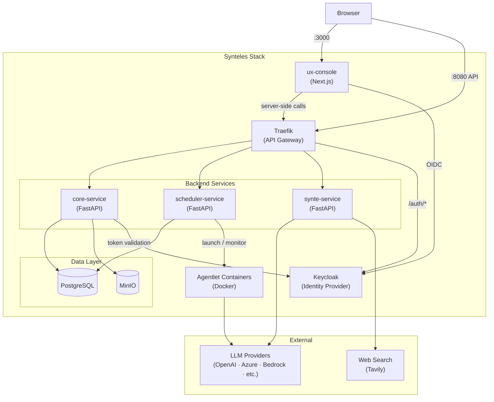

# Architecture

Synteles is a multi-service platform for AI workers and long-running enterprise workflows. This document gives a high-level overview of the system structure.

## Services

| Service | Technology | Responsibility |
|---|---|---|
| **core-service** | FastAPI (Python) | Primary REST API — agentlets, users, secrets, files, org management |
| **scheduler-service** | FastAPI (Python) | Execution engine — launches and monitors agentlet containers |
| **synte-service** | FastAPI (Python) | AI chat assistant — conversational interface powered by LiteLLM and Strands Agents |
| **ux-console** | Next.js (TypeScript) | Web frontend — App Router, Tailwind CSS, shadcn/ui |
| **platform-db** | Python library | Shared SQLAlchemy models and Alembic migrations, used by core and scheduler |

## Infrastructure

| Component | Role |
|---|---|
| **Traefik** | API gateway and reverse proxy — single entry point for all API traffic |
| **Keycloak** | Identity provider — OIDC-based authentication and authorization |
| **PostgreSQL** | Primary relational database — agentlets, users, workflow state, secrets |
| **MinIO** | S3-compatible object storage — uploaded files, execution artifacts, conversation blobs |

## High-Level Diagram

## Request Flow

1. The browser opens the **ux-console** at `:3000` and authenticates via **Keycloak** (OIDC Authorization Code + PKCE).
2. API calls from the UI flow through **Traefik** (`:8080`), which routes traffic to the appropriate backend service and validates JWT tokens.
3. **core-service** handles all agentlet lifecycle operations and persists state in **PostgreSQL**. Files and execution artifacts are stored in **MinIO**.
4. When an agentlet execution is triggered, **scheduler-service** launches a dedicated **agentlet container** and monitors it until completion.
5. Agentlet containers call **LLM providers** (via LiteLLM) and optional tools such as web search (Tavily).
6. **synte-service** powers the Synte chat interface, also routing through LiteLLM for model-agnostic access.

## Deployment

For local development the full stack is orchestrated with Docker Compose. See the [Quick Start](../README.md#quick-start) section in the root README.

Production deployment is manual for this release. Refer to [SECURITY.md](../SECURITY.md) for hardening guidance before exposing the platform outside a local environment.
