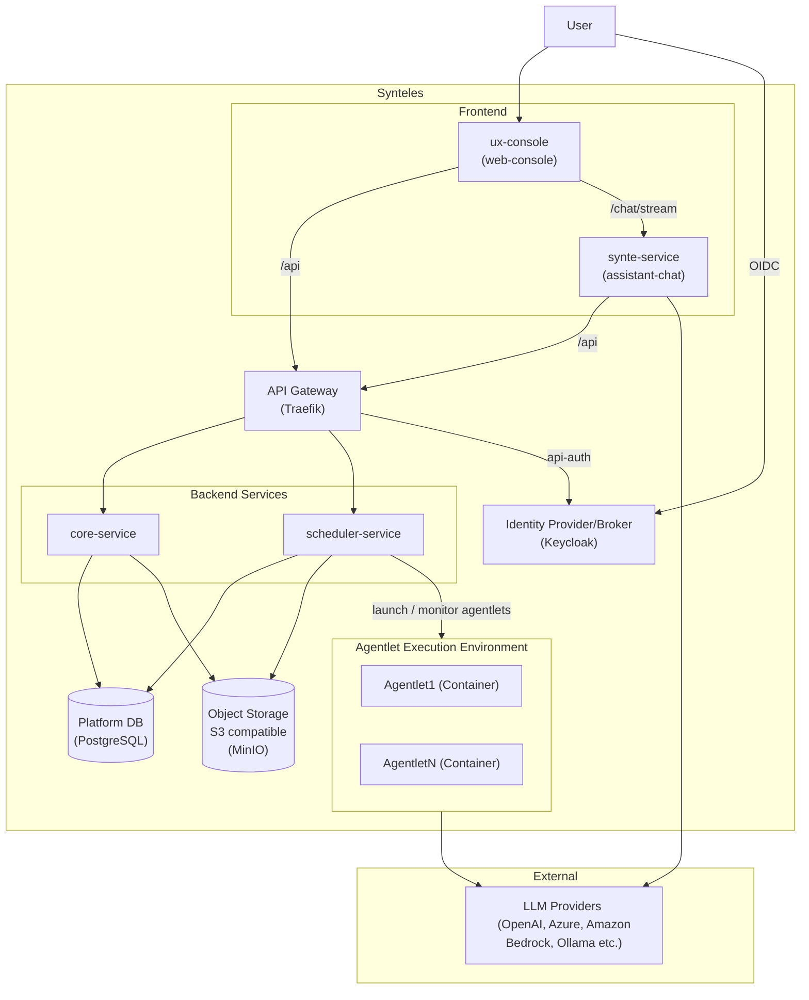

# Architecture

Synteles is a multi-service platform for AI workers and enterprise workflows. This document gives a high-level overview of the system structure.

Synteles is committed to principle of open, pluggable and extensible architecture.

## Services

| Service | Technology | Responsibility |
|---|---|---|
| **core-service** | FastAPI (Python) | Primary REST API — agentlets, users, secrets, files, org management |
| **scheduler-service** | FastAPI (Python) | Execution engine — launches and monitors agentlet containers |
| **synte-service** | FastAPI (Python) | AI chat assistant — conversational interface powered by LiteLLM and Strands Agents ADK |
| **ux-console** | Next.js (TypeScript) | Web frontend — App Router, Tailwind CSS, shadcn/ui |
| **platform-db** | Python library | Shared SQLAlchemy models and Alembic migrations, used by core and scheduler |

## Infrastructure

Synteles is designed to be portable. Depending on environment where it is deployed, components below can be deployed as managed services self-operated components.

| Component | Role |
|---|---|
| **Traefik** | API gateway and reverse proxy — single entry point for all API traffic |
| **Keycloak** | Identity provider/Identity broker OIDC-based authentication and authorization |
| **PostgreSQL** | Primary relational database — agentlets, users, workflow state, secrets |
| **MinIO** | S3-compatible object storage — uploaded files, execution artifacts, conversation blobs |

## Architecture Diagram

## Request Flow

1. The browser opens the **ux-console** at `:3000` and authenticates via **Keycloak** (OIDC Authorization Code + PKCE).
2. API calls from the UI flow through **Traefik** (`:8080`), which routes traffic to the appropriate backend service and validates JWT tokens.
3. **core-service** handles all agentlet lifecycle operations and persists state in **PostgreSQL**. Uploaded files are stored in **MinIO**.
4. When an agentlet execution is triggered, **scheduler-service** launches a dedicated **agentlet container**, monitors it until completion, and uploads execution logs and output artifacts to **MinIO**.
5. Agentlet containers call **LLM providers** (via LiteLLM) and optional tools such as web search (Tavily).
6. **synte-service** powers the Synte chat interface, also routing through LiteLLM for model-agnostic access.

## Identity and Authentication

Keycloak serves two distinct roles depending on deployment scale.

**Small deployments — Identity Provider**

Keycloak acts as the primary identity provider. Users and credentials are managed directly in the Keycloak realm. This is the default configuration in the local Docker Compose setup and is suitable for self-contained deployments where Synteles owns the user directory.

**Enterprise deployments — Identity Broker**

Keycloak acts as an identity broker, delegating authentication to an existing enterprise identity system. Synteles receives a standard OIDC token regardless of the upstream provider — no changes to the platform are required.

Supported federation protocols include:

- **SAML 2.0** — integrates with Active Directory Federation Services (ADFS), Okta, OneLogin, PingFederate, and other SAML-compliant identity providers
- **OIDC** — integrates with Azure Entra ID (formerly Azure AD), Google Workspace, Auth0, and any OIDC-compliant provider
- **LDAP / Active Directory** — direct user federation for organisations that prefer to synchronise the user directory into Keycloak rather than delegate authentication

In broker mode, Keycloak handles the protocol translation and attribute mapping. Enterprise users log in through their existing SSO experience; Synteles sees a normalised JWT token with the expected claims.

## Deployment

For local development the full stack is orchestrated with Docker Compose. See the [Quick Start](../README.md#quick-start) section in the root README.

Production deployment is manual for this release. Refer to [SECURITY.md](../SECURITY.md) for hardening guidance before exposing the platform outside a local environment.
