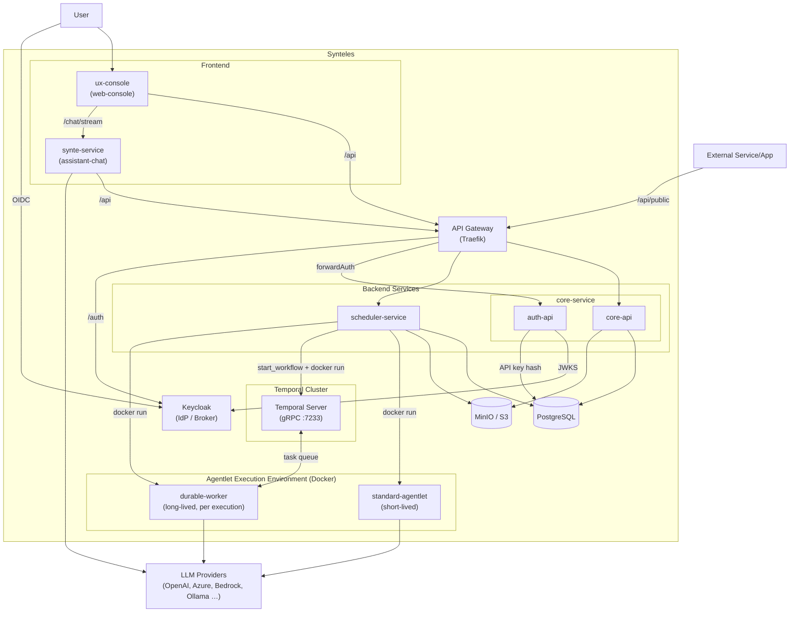
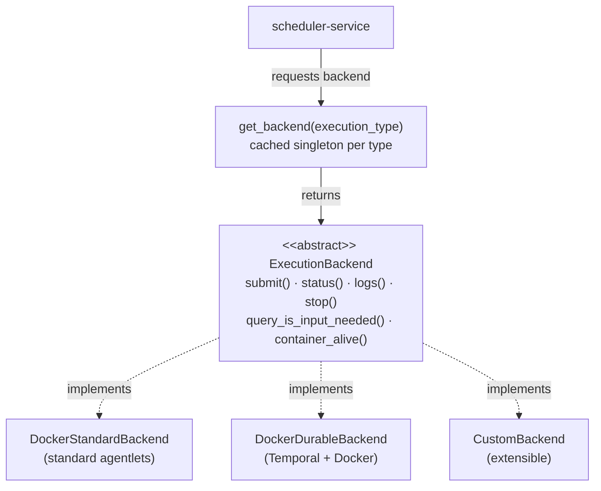

# Architecture

This document gives a high-level overview of the system design.

Synteles is committed to principle of open, pluggable and extensible architecture.

## Services

| Service | Technology | Responsibility |
|---|---|---|
| **core-service** | FastAPI (Python) | Primary REST API: agentlets, users, orgs, API keys, secrets, files, connectors, conversations, model presets |
| **scheduler-service** | FastAPI (Python) | Execution engine: launches and monitors agentlet containers; HITL signal delivery |
| **durable-worker** | Python + Temporal SDK | Temporal worker: runs `AgentWorkflow` (ReAct loop + HITL) for durable agentlet executions |
| **synte-service** | FastAPI (Python) | AI chat assistant (Synte) conversational interface powered by LiteLLM and Strands Agents ADK |
| **ux-console** | Next.js (TypeScript) | Web frontend: App Router, Tailwind CSS, shadcn/ui |
| **platform-db** | Python library | Shared SQLAlchemy models and Alembic migrations, used by core and scheduler |

## Infrastructure

Synteles is designed to be portable. Depending on environment where it is deployed, components below can be represented as managed services or self-operated components.

| Component | Role |
|---|---|
| **Traefik** | API gateway and reverse proxy is a single entry point for all API traffic |
| **Keycloak** | Identity provider/Identity broker OIDC-based authentication and authorization |
| **PostgreSQL** | Platform database to store agentlets, users, execution state, secrets data |
| **MinIO** | S3-compatible object storage to store uploaded files, execution artifacts, conversation blobs |
| **Temporal** | Durable workflow engine: persists AgentWorkflow history, drives retries, and handles HITL pausing |

## Architecture Diagram

## Request Flow

1. The browser opens the **ux-console** at `:3000` and authenticates via **Keycloak** (OIDC Authorization Code + PKCE).
2. API calls from the UI flow through **Traefik** (`:8080`), which routes traffic to the appropriate backend service and validates JWT tokens.
3. **core-service** handles all agentlet lifecycle operations and persists state in **PostgreSQL**. Uploaded files and conversation blobs are stored in **MinIO**.
4. When an agentlet execution is triggered, **scheduler-service** launches a dedicated container and monitors it until completion, uploading execution logs and output artifacts to **MinIO**. Two execution paths exist:
   - **Standard**: a short-lived container runs the agentlet and exits on completion.
   - **Durable**: a **Temporal** workflow is started and a **durable-worker** container registers on its task queue. The workflow persists full history, survives container crashes, and can pause for human input (`waiting_for_signal`). The monitor bridges HITL state between Temporal and the platform database.
5. Agentlets call **LLM providers** (via LiteLLM).
6. **synte-service** powers the Synte chat interface, routing through LiteLLM for model-agnostic access.

## Scheduler Pluggable Backend Architecture

The scheduler-service uses an abstract `ExecutionBackend` interface. The active backend is selected at startup via the `EXECUTION_BACKEND` environment variable — no code changes are required to switch runtimes.

`ExecutionBackend` is an abstract base class. `get_backend(execution_type)` returns a **cached singleton** per execution type — `DockerStandardBackend` for standard agentlets, `DockerDurableBackend` for Temporal-backed durable executions. New runtimes (e.g. Kubernetes) are a drop-in addition.

## Identity and Authentication

Keycloak serves two distinct roles depending on deployment scale.

**Small deployments — Identity Provider**

Keycloak acts as the primary identity provider. Users and credentials are managed directly in the Keycloak realm. This is the default configuration in the local Docker Compose setup and is suitable for self-contained deployments where Synteles owns the user directory.

**Enterprise deployments — Identity Broker**

Keycloak acts as an identity broker, delegating authentication to an existing enterprise identity system. Synteles receives a standard OIDC token regardless of the upstream provider — no changes to the platform are required.

Supported federation protocols include:

- **SAML 2.0** — integrates with Active Directory Federation Services (ADFS), Okta, OneLogin, PingFederate, and other SAML-compliant identity providers
- **OIDC** — integrates with Azure Entra ID (formerly Azure AD), Google Workspace, Auth0, and any OIDC-compliant provider
- **LDAP / Active Directory** — direct user federation for organisations that prefer to synchronise the user directory into Keycloak rather than delegate authentication

In broker mode, Keycloak handles the protocol translation and attribute mapping. Enterprise users log in through their existing SSO experience; Synteles sees a normalised JWT token with the expected claims.

**Gateway-enforced authentication**

Authentication is enforced at the API gateway layer rather than inside each backend service. Traefik routes every request through a `forwardAuth` middleware that calls `core-service /auth/verify` before the request reaches its destination. Two middleware variants enforce credential type structurally: private routes (`/api/*`) accept only `Authorization: Bearer <JWT>`, validated against Keycloak's JWKS endpoint; public routes (`/api/public/*`) accept only `X-API-Key`, validated against a SHA-256 hash stored in PostgreSQL. A JWT cannot authenticate a public route and an API key cannot authenticate a private route — this is enforced by gateway configuration, not application code.

On successful verification, the gateway injects `X-User-Id` and `X-Org-Id` headers and forwards the request downstream. Backend services trust these headers without performing any token validation themselves, keeping auth logic centralised in a single place. The first-login provisioning flow is an intentional exception: a user whose organisation has not yet been created in the database is allowed through `verify` with an empty `X-Org-Id`, so that their first call to `GET /api/users/me` can trigger automatic provisioning. All other routes that require an organisation reject such requests with a 401 before any business logic runs.

## Deployment

For local development the full stack is orchestrated with Docker Compose. See the [Quick Start](../README.md#quick-start) section in the root README.

Production deployment is manual for this release. Refer to [SECURITY.md](../SECURITY.md) for hardening guidance before exposing the platform outside a local environment.
