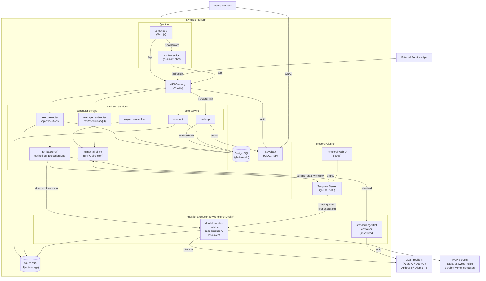
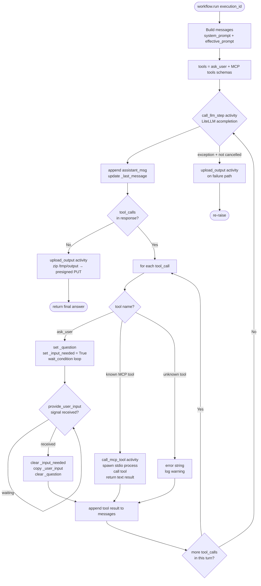

# Durable Execution — Architecture Reference

> PR #43 — `feat: durable execution via Temporal — AgentWorkflow, HITL signal bridge, DB refactor`

---

## What This PR Adds

Before this PR, Synteles supported only short-lived **standard** agentlet containers — a process ran, finished, and the monitor recorded the result. There was no way to pause mid-execution and ask a human for input.

This PR introduces a parallel **durable** execution path that wraps every agentlet run in a long-lived [Temporal](https://temporal.io) workflow. The workflow persists its full execution history, survives container crashes (Temporal keeps retrying), and can pause at an `ask_user` tool call and wait indefinitely for a human signal before continuing.

| Capability | Standard | Durable |
|---|---|---|
| Execution persistence across crashes | No — restart from scratch | Yes — Temporal replays history |
| Human-in-the-loop pause | No | Yes — `waiting_for_signal` |
| LLM provider | Via agentlet YAML / platform model | LiteLLM (`{provider}/{model_id}`) |
| Container lifetime | Short-lived, exits when done | Long-lived, polls Temporal task queue |
| `ask_user` tool | Not available | Pauses workflow, signals resume it |
| `execution_backend` setting | `standard` | `durable` |

---

## Updated Platform Architecture



---

## Execution Backend Architecture

### Class Hierarchy

```
ExecutionBackend  (ABC — backends/base.py)
│
│  submit(config: ExecutionConfig) → job_ref: str
│  status(job_ref) → ExecutionStatus
│  logs(job_ref) → str
│  stop(job_ref)
│  query_is_input_needed(job_ref) → bool | None   [default: None]
│  container_alive(job_ref) → bool                [default: True]
│
├── DockerStandardBackend   (backends/docker_standard.py)
│     Thin wrapper. Delegates all operations to DockerRuntime.
│     job_ref = container ID (returned by docker run)
│     container_alive() inherits default → True
│
└── DockerDurableBackend    (backends/docker_durable.py)
      Orchestrates Temporal + Docker.
      job_ref = execution_id  (UUID string)
      Derives workflow_id and container_name deterministically.
      query_is_input_needed() → polls Temporal "is_input_needed" query
      container_alive() → checks Docker container status

DockerRuntime  (backends/docker_runtime.py)
  Stateless helper; shared by both Docker backends.
  run_container() · stop_container() · container_status() · container_logs()
```

### Backend Factory

`get_backend(ExecutionType)` returns a **module-level cached singleton** per execution type.
This means `DockerRuntime()` (Docker SDK socket) and the Temporal client's gRPC connection are each opened once, not once per execution per monitor tick.

```
EXECUTION_RUNTIME=docker (env var, selects infrastructure provider)
execution_type=standard|durable (per-agentlet DB column, selects execution model)

         ┌──────────────────────────────────┐
         │         get_backend(type)        │
         │   _cache: dict[ExecutionType,    │
         │           ExecutionBackend]      │
         └──────────┬───────────────────────┘
                    │
         ┌──────────▼──────────┐
  type=standard          type=durable
         │                     │
DockerStandardBackend   DockerDurableBackend
```

---

## Agentlet Execution Backend — Setting

`execution_backend` was previously an optional YAML field inside the agentlet definition, which meant it had to be parsed from YAML on every execution, could not be indexed, and was invisible in API responses.

**Migration 0004** promoted it to a first-class column on the `agentlets` table (reusing the existing `execution_type` PostgreSQL enum, `DEFAULT 'standard'`). A backfill step sets any rows whose YAML contained `execution_backend: durable` to the new column.

```
Before:
  agentlet.yaml_definition → parse YAML → read execution_backend → fallback to env var

After:
  agentlet.execution_backend (DB column) → one-liner read
```

The YAML field was removed from `agentlet-schema.json`. It is no longer parsed or honoured.

---

## Execution Submit Flow

### Standard Execution

```
POST /api/executions
        │
        ▼
scheduler-service / execute.py
  1. Look up agentlet by name → read execution_backend column
  2. Create execution row (status=deploying)
  3. Copy input files (S3 upload bucket → logs bucket)
  4. Generate presigned PUT URL for output.zip
  5. Build manifest JSON  {agentlet_yaml, input_files, output_url, prompt, timeout}
  6. Upload manifest to s3://…/executions/{id}/manifest.json
  7. Generate presigned GET URL for manifest
  8. Resolve secrets (user secrets + platform model secrets)
  9. call get_backend(standard).submit()
     └── DockerStandardBackend.submit()
           └── DockerRuntime.run_container(AGENTLET_IMAGE, execution_id, env)
                  env includes: SYNTELES_MANIFEST_URL, SYNTELES_EXEC_ID, decrypted secrets
 10. Update execution row: status=running, job_ref=container_id
 11. Return 202 {execution_id, status:"running"}
```

### Durable Execution

```
POST /api/executions
        │
        ▼
scheduler-service / execute.py
  1–8. Same as standard (manifest upload, secrets, presigned URLs)
       + SYNTELES_OUTPUT_URL added to container env (worker needs it for output upload)
  9. call get_backend(durable).submit()
     └── DockerDurableBackend.submit()
           a. client.start_workflow("AgentWorkflow", execution_id,
                id="synteles-{execution_id}",
                task_queue="synteles-agent-{execution_id}")
              Temporal queues the first workflow task immediately.
              The worker has not registered yet — Temporal holds the task.
           b. DockerRuntime.run_container(AGENT_WORKER_IMAGE, "agent-{id}", env)
              Container boots, fetches manifest, queries MCP tools,
              then registers on the task queue. Temporal dispatches queued task.
 10. Update execution row: status=running, job_ref=execution_id,
                           workflow_id="synteles-{execution_id}"
 11. Return 202 {execution_id, status:"running"}
```

**Why start the workflow before the container?**
Temporal can safely hold a workflow task for minutes until a worker registers. Starting the workflow first ensures the execution ID is recorded in Temporal's event history from the beginning, so if the container never starts, Temporal's timeout mechanisms still have a record to work with.

---

## durable-worker Service — Internals

### Module Layout

```
durable-worker/
├── worker.py          Entrypoint. Startup orchestration, Temporal worker registration.
├── manifest.py        Fetch + parse agentlet YAML from presigned S3 URL.
├── agent_config.py    Module-level singletons populated at startup (system_prompt,
│                      model, tools_schema, mcp_tool_map, output_url).
├── config.py          Env var declarations (TEMPORAL_ADDRESS, TEMPORAL_TASK_QUEUE,
│                      EXECUTION_ID, SYNTELES_MANIFEST_URL, SYNTELES_OUTPUT_URL).
├── activities.py      Temporal activities: call_llm_step, call_mcp_tool, upload_output.
└── workflows/
    └── agent.py       AgentWorkflow — ReAct loop, HITL signal/query surface.
```

### Key Data Classes (manifest.py)

```
MCPToolSpec
  name:    str          agentlet YAML tool name (for logging)
  command: str          stdio server command (e.g. "uvx", "npx")
  args:    list[str]    CLI arguments
  env:     dict[str,str] static env overrides from YAML

AgentletSpec
  system_prompt: str
  prompt:        str | None   YAML default prompt (None if unset)
  provider:      str          e.g. "azure_ai", "openai", "anthropic"
  model_id:      str          e.g. "gpt-5.3-chat", "gpt-4o"
  mcp_tools:     list[MCPToolSpec]
```

Only `stdio` MCP servers are supported in the durable worker. Servers declared with `server: http` or any other type are silently skipped during `parse_agentlet()`.

### Startup Sequence

```
worker.py: main()
  │
  ├── 1. Validate env vars (SYNTELES_MANIFEST_URL, TEMPORAL_TASK_QUEUE, EXECUTION_ID)
  │
  ├── 2. fetch_manifest(SYNTELES_MANIFEST_URL)
  │        GET presigned S3 URL → parse JSON
  │        Returns: {agentlet_yaml, input_files, output_url, prompt, timeout}
  │
  ├── 3. Download input files → /tmp/input/
  │        SSRF guard: input file URLs must share the same host:port as the manifest URL
  │
  ├── 4. parse_agentlet(manifest)
  │        Parse agentlet_yaml → AgentletSpec
  │        (system_prompt, provider, model_id, mcp_tools list)
  │
  ├── 5. resolve_prompt(manifest, spec)
  │        Runtime prompt (from manifest.prompt) overrides YAML default
  │        Raises if both are empty
  │
  ├── 6. Populate agent_config module-level singletons
  │        system_prompt, effective_prompt, model = "{provider}/{model_id}"
  │        output_url = SYNTELES_OUTPUT_URL (env) or manifest.output_url
  │
  ├── 7. _fetch_mcp_schemas(spec.mcp_tools)
  │        For each stdio MCP server:
  │          spawn process → ClientSession.initialize() → list_tools()
  │          Build OpenAI-format tool schema dicts
  │          Build tool_name → MCPServerRef mapping
  │        Servers that fail to connect are skipped (warning logged)
  │
  ├── 8. Populate agent_config.tools_schema, agent_config.mcp_tool_map
  │
  └── 9. Client.connect(TEMPORAL_ADDRESS)
           Worker(task_queue, workflows=[AgentWorkflow], activities=[…])
           worker.run()  ← blocks until container exits
```

### LiteLLM Model String

The model is assembled as `"{provider}/{model_id}"` — e.g. `"azure_ai/gpt-5.3-chat"`. LiteLLM routes to the correct SDK based on the prefix, and reads credentials from the container's environment variables (injected from the agentlet's `secrets` list by the scheduler). `litellm.drop_params = True` suppresses provider-specific parameters not supported by the active backend (e.g. `tool_choice` on providers that do not accept it).

---

## AgentWorkflow — ReAct Loop

The workflow implements a manual ReAct (Reason + Act) loop. **Every non-deterministic operation is an activity** so Temporal can replay the workflow history correctly after a crash.



### Temporal Interface Surface

| Type | Name | Signature | Purpose |
|---|---|---|---|
| **Signal** | `provide_user_input` | `(user_input: str)` | Deliver human answer to a paused `ask_user`. Sets `_user_input`, clears `_input_needed`. |
| **Signal** | `update_output_url` | `(new_url: str)` | Refresh the presigned S3 PUT URL. Sent by `worker_restart.py` on each container restart so the URL does not expire. |
| **Query** | `is_input_needed` | `→ bool` | Polled by monitor every tick. `True` when workflow is blocked at `ask_user`. |
| **Query** | `get_pending_question` | `→ str` | The question text from the current `ask_user` call. Surfaced in GET status response. |
| **Query** | `get_last_message` | `→ str` | Last assistant message (even if not a final answer). Lets callers track progress. |

### Activity Retry Policies

Retries are intentionally generous to absorb transient LLM errors and survive worker container restarts. The retry budget for `call_llm_step` gives ~10+ minutes before Temporal gives up.

| Activity | Max Attempts | Initial Interval | Backoff | Max Interval |
|---|---|---|---|---|
| `call_llm_step` | 10 | 30 s | ×2 | 120 s |
| `call_mcp_tool` | 5 | 30 s | ×2 | 120 s |
| `upload_output` | 3 | 10 s | ×2 | 30 s |

---

## Monitor — HITL Signal Bridge

The monitor runs as an `asyncio` background task inside `scheduler-service`, polling every `MONITOR_INTERVAL_SECONDS`. All status transitions for both standard and durable executions flow through it — there are no HTTP callbacks from `durable-worker` to the platform.

**Why no callbacks?**
A callback approach would require the durable-worker container to authenticate to the scheduler API, adding service-to-service credential management and a surface area for auth bypass bugs. The monitor-pull design keeps all status logic in one place and requires no changes to the container.

### Poll Loop Logic

```
_poll()
  │
  ├── list_active() from DB (one session for the whole batch)
  │
  ├── Build backends dict: { ExecutionType → ExecutionBackend }
  │     One DockerRuntime + one Temporal client per poll tick (cached singletons)
  │
  └── for each execution with a job_ref:
        │
        ├── timeout_at < now?
        │     └── _finalize(stopped)  [cancel workflow + stop container + upload logs]
        │
        ├── backend.status() == COMPLETED → _finalize(completed)
        ├── backend.status() == FAILED    → _finalize(failed)
        │
        └── status == RUNNING and execution_type == durable:
              │
              ├── _sync_durable_signal_status()
              │     Query Temporal: is_input_needed?
              │     true  + DB=running            → DB: running → waiting_for_signal
              │                                       set timeout_at = now + SIGNAL_WAIT_TIMEOUT
              │     false + DB=waiting_for_signal  → DB: waiting_for_signal → running
              │
              └── container_alive()?
                    No → ensure_worker_running()  [restart dead container]
```

### _finalize() Sequence

```
_finalize(execution, terminal_status, backend, db)
  1. backend.logs(job_ref)        — fetch container stdout/stderr
  2. Upload logs → s3://…/executions/{id}/logs.txt
  3. ExecutionRepo.update_status(terminal_status, completed_at=now, logs_s3_uri)
  4. db.commit()
  5. backend.stop(job_ref)        — for durable: Temporal cancel + docker stop+rm
```

---

## HITL — Full Signal Round-Trip

This diagram shows every component involved when a workflow pauses to ask the user a question, the user answers via the API, and the workflow resumes.

```
durable-worker                Temporal               scheduler-service            ux-console
     │                            │                         │                         │
     │ ask_user tool call          │                         │                         │
     │ _input_needed = True        │                         │                         │
     │◄── wait_condition ──────────│                         │                         │
     │                            │                         │                         │
     │                            │  ← monitor tick          │                         │
     │                            │  query is_input_needed   │                         │
     │                            │──────────────────────────►                         │
     │                            │  ◄── True                │                         │
     │                            │                         │                         │
     │                            │  DB: running →          │                         │
     │                            │  waiting_for_signal     │                         │
     │                            │                         │                         │
     │                            │                         │  GET /executions/{id}   │
     │                            │                         │◄────────────────────────│
     │                            │  get_pending_question   │                         │
     │                            │──────────────────────────►                         │
     │                            │  ◄── "Approve deletion?" │                         │
     │                            │                         │──── 200 {status:        │
     │                            │                         │  waiting_for_signal,    │
     │                            │                         │  pending_question: ...} │
     │                            │                         │────────────────────────►│
     │                            │                         │                         │
     │                            │  POST /executions/{id}/signal {input:"yes"}       │
     │                            │                         │◄────────────────────────│
     │                            │  ensure_worker_running()│                         │
     │                            │  update_output_url signal│                        │
     │                            │  provide_user_input("yes")                        │
     │                            │──────────────────────────►                        │
     │◄── signal received         │                         │                         │
     │ _input_needed = False       │                         │  202 {status:running}   │
     │ wait_condition exits        │                         │────────────────────────►│
     │ continue ReAct loop         │                         │                         │
     │                            │  ← next monitor tick     │                         │
     │                            │  is_input_needed → False │                         │
     │                            │  DB: waiting_for_signal → running                 │
```

### Signal Endpoint Guards (409 Conflict)

The signal endpoints reject the request if any of these conditions hold:

| Condition | Reason |
|---|---|
| `execution_type != durable` | Standard executions have no Temporal workflow to signal |
| `status != waiting_for_signal` | Delivering a signal to a running workflow would corrupt the message loop |
| `workflow_id IS NULL` | No Temporal handle to address; execution may have failed to start |

---

## Worker Container Restart

The `worker_restart.py` module handles two scenarios where the `durable-worker` container may no longer be running while the Temporal workflow is still live:

| Trigger | Scenario |
|---|---|
| **Monitor** | Container exited (OOM, crash) while workflow is `RUNNING` in Temporal |
| **Signal delivery** | Container may have exited during a long `waiting_for_signal` pause |

In both cases `ensure_worker_running()`:
1. Checks `container_alive()` — skips if container is already up.
2. Re-assembles container env vars (re-fetches secrets from DB, regenerates a fresh presigned GET URL for the existing manifest already in S3 — no re-upload).
3. Generates a fresh presigned PUT URL for output.zip (sent as `update_output_url` signal to the workflow so the old URL is not used after expiry).
4. Calls `DockerRuntime.run_container()` with the original container name.

The Temporal workflow re-dispatches its pending activity to the newly registered worker. From Temporal's perspective, the container restart is just a slow retry.

---

## Execution Status State Machines

### Standard

```
submit
  │
  ▼
deploying ──► running ──► completed
                     └──► failed
                     └──► stopped   (timeout or cancel)
```

### Durable

```
submit
  │
  ▼
deploying ──► running ──────────────────────────► completed
                │                                  │
                │ ask_user tool                     │ failed
                ▼                   signal          │ stopped (timeout/cancel)
         waiting_for_signal ──────► running ───────►│
                │
                └── signal timeout ──► stopped
```

**DB enforcement:** A PostgreSQL `CHECK` constraint ensures only valid status values can be written per execution type:

```sql
CHECK (
  (execution_type = 'standard' AND status IN ('deploying','running','completed','failed','stopped'))
  OR
  (execution_type = 'durable'  AND status IN ('deploying','running','waiting_for_signal',
                                               'completed','failed','stopped'))
)
```

This means a durable status like `waiting_for_signal` cannot accidentally be written on a standard execution row and vice versa — enforced at the DB layer, not just application code.

---

## Database Schema

### Migrations Applied

| File | Description |
|---|---|
| `0003_durable_executions.py` | Add `execution_type` enum (`standard` \| `durable`). Add `execution_type` column to `executions` (default `standard`). Add `workflow_id TEXT` (Temporal workflow ID). Add `timeout_at TIMESTAMPTZ`. Add `waiting_for_signal` to valid status values. |
| `0004_agentlet_execution_backend.py` | Add `execution_backend execution_type NOT NULL DEFAULT 'standard'` to `agentlets`. Backfill rows whose YAML contains `execution_backend: durable`. |
| `0005_drop_signal_name.py` | Drop unused `signal_name TEXT` column from `executions`. The signal name is always `provide_user_input` — hardcoded at the delivery site. |

### Agentlet Model (relevant fields)

```
agentlets
  id:                 UUID  PK
  org_id:             UUID  FK
  user_id:            UUID  FK
  name:               TEXT  UNIQUE per org
  yaml_definition:    TEXT
  execution_backend:  execution_type  NOT NULL  DEFAULT 'standard'   ← NEW
  created_at, updated_at
```

### Execution Model (relevant fields)

```
executions
  id:             UUID  PK
  execution_type: execution_type  NOT NULL  DEFAULT 'standard'         ← NEW
  status:         TEXT  NOT NULL  [validated by CHECK constraint]
  job_ref:        TEXT            standard: container_id / durable: execution_id
  workflow_id:    TEXT            durable only: "synteles-{execution_id}"  ← NEW
  timeout_at:     TIMESTAMPTZ     execution deadline + signal wait deadline  ← NEW
  logs_s3_uri:    TEXT            set on finalize
  prompt:         TEXT
  completed_at:   TIMESTAMPTZ
```

### Object Storage Layout

```
s3://{S3_LOGS_BUCKET}/
  executions/{id}/
    manifest.json          Execution manifest (agentlet YAML, input files, prompt, output URL)
    input/{filename}       Input files copied from upload bucket
    logs.txt               Container stdout/stderr (written on finalize)
    output/output.zip      Agent output artifacts (uploaded by durable-worker upload_output activity)

s3://{S3_UPLOAD_BUCKET}/
  {upload_id}/{filename}   User-uploaded files (pre-execution)
```

---

## Temporal Client Singleton

Both `DockerDurableBackend` (submit, status, stop, query) and the management router (signal delivery, status queries) need a Temporal client. Without a singleton, a new gRPC connection would be opened on every monitor tick and every API request.

`temporal_client.py` implements a **double-checked locking** singleton:

```
get_temporal_client()
  if _client is None:
    async with _lock:           ← asyncio.Lock, prevents races on first call
      if _client is None:       ← re-check inside lock
        _client = await Client.connect(TEMPORAL_ADDRESS)
  return _client
```

The same `Client` instance is reused indefinitely. If the connection drops, `temporalio` reconnects transparently on the next RPC.

---

## API — New and Changed Endpoints

### New Endpoints (scheduler-service)

| Method | Path | Auth | Status | Description |
|---|---|---|---|---|
| `POST` | `/api/executions/{id}/signal` | Bearer JWT | 202 | Deliver user input to a paused durable workflow |
| `POST` | `/api/public/executions/{id}/signal` | X-API-Key | 202 | Same, for external API callers |

**Request body:** `{ "input": "<user answer>" }`

**Response (202):** `{ "status": "running", … }` — optimistic DB flip to `running` before Temporal confirms.

**Error responses:**

| Code | Condition |
|---|---|
| 404 | Execution not found |
| 409 | Not durable / not `waiting_for_signal` / no `workflow_id` |
| 500 | Temporal RPC failure |

### Enriched Status Response

`GET /api/executions/{id}` and `GET /api/public/executions/{id}` now include:

| Field | When present | Source |
|---|---|---|
| `pending_question` | `status == waiting_for_signal` | Temporal `get_pending_question` query |
| `last_message` | Always for durable (when available) | Temporal `get_last_message` query |
| `execution_type` | Always | DB column |

### Agentlet Endpoints (core-service)

`POST /api/agentlets`, `GET /api/agentlets`, `GET /api/agentlets/{id}`, `PATCH /api/agentlets/{id}` all now accept and return `execution_backend: "standard" | "durable"`.

The list endpoint (`GET /api/agentlets`) previously omitted `execution_backend` — this was fixed to prevent the frontend from always defaulting to `standard` after page load.

---

## Frontend Changes

### New UI Components

| Component | File | Purpose |
|---|---|---|
| `BackendBadge` | `components/agentlets/` | Pill badge — "Standard" (gray) / "Durable" (blue) |
| `ToggleGroup` | `components/ui/toggle-group.tsx` | shadcn/ui `@radix-ui/react-toggle-group` wrapper |

### Modified Components

| Component | Change |
|---|---|
| `AgentletsPage` | Standard/Durable `ToggleGroup` in create and edit drawers. Contextual hint paragraph per choice. Passes `execution_backend` through `createAgentlet` / `updateAgentlet` actions. |
| `AgentletCard` | `BackendBadge` in card header — backend type visible at a glance. |
| `RunsTable` | `Backend` column with `BackendBadge` between Status and Created. |
| `ExecutionDetailSheet` | HITL UI: shows `pending_question` when `waiting_for_signal`; signal input field + submit button; polls for state changes. |
| `WatchdogProvider` | Updated active-run polling to handle `waiting_for_signal` as an active status. |

### Type Changes

`ExecutionType` added to `Execution` / `ExecutionApi` TypeScript types. `AgentletApi` and `Agentlet` types include `execution_backend`. `fromApi` mapping updated.

---

## Key Design Decisions

| Decision | Choice | Rationale |
|---|---|---|
| HITL detection mechanism | Monitor polls `is_input_needed` Temporal query | No service-to-service auth needed; all status logic stays in one place |
| Signal delivery response | Optimistic flip to `running` immediately (202) | Monitor confirms on next tick; avoids a round-trip wait for Temporal to acknowledge |
| Per-execution task queue | `synteles-agent-{execution_id}` | Isolates each workflow to its own worker; prevents cross-execution interference |
| `job_ref` for durable | `execution_id` (UUID) | Stable primary key; no string parsing needed to derive Temporal ID or container name |
| Worker restart approach | Monitor detects dead container; `ensure_worker_running()` relaunches | Temporal retries keep the workflow alive; the container is a stateless activity runner |
| `execution_backend` DB column | `execution_type` enum reused | Avoids a new enum type; semantically correct — same domain values |
| LiteLLM over `openai-agents` SDK | LiteLLM | Provider-agnostic; Azure AI, Anthropic, OpenAI, Ollama all work via the same mechanism used by standard agentlets |
| Signal name hardcoded | Always `provide_user_input` | `signal_name` column was redundant; dropped in migration 0005 |
| `activity-worker` removal | Deleted | Was a Zigflow DSL relic; no longer on any execution path |
