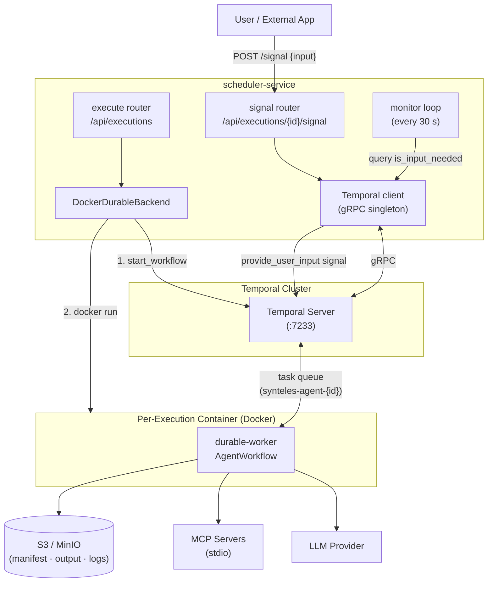

# Durable Execution — Architecture Reference

## Overview

Standard agentlets run as short-lived containers. The scheduler starts a Docker container, the agent executes, and the monitor records the result. There is no persistence: if the container crashes mid-run, the execution fails and must be restarted from scratch.

**Durable execution** wraps every agent run in a [Temporal](https://temporal.io) workflow. Temporal continuously journals the full execution history — every LLM call and tool result — to its own database. If the container crashes, the scheduler detects the failure, starts a new container, and Temporal replays the recorded history to bring the new worker back to exactly where it left off. Only the step in progress is retried; completed steps are not re-executed.

This design also enables **human-in-the-loop** (HITL) pauses. When an agent calls the `ask_user` tool, the workflow suspends and waits indefinitely for a human signal. The container can exit during the wait — when the user provides input via the API, the scheduler restarts the container if needed and delivers the signal to resume.

Practical implications:

- Long-running jobs can be interrupted (OOM, host maintenance, intentional pause) and resume without losing progress.
- Agents that require human approval or clarification before continuing do not need to re-run prior steps when the user responds.
- Temporal's workflow history provides a structured audit log of every activity, separate from container stdout logs.
- Standard executions remain available for short, stateless tasks where the overhead of a durable workflow is unnecessary.

| Capability | Standard | Durable |
|---|---|---|
| Crash recovery | Restart from scratch | Temporal replays history |
| Human-in-the-loop pause | No | Yes — `waiting_for_signal` |
| LLM provider | Via agentlet YAML / platform model | LiteLLM (`{provider}/{model_id}`) |
| Container lifetime | Short-lived, exits when done | Long-lived, polls Temporal task queue |
| `ask_user` tool | Not available | Pauses workflow; signal resumes it |
| `execution_backend` setting | `standard` | `durable` |

---

## Durable Execution Architecture



---


| Component | Description |
|---|---|
| **execute router** | Accepts `POST /api/executions`. Calls `DockerDurableBackend.submit()`, which registers the Temporal workflow first and then launches the per-execution container. |
| **signal router** | Accepts `POST /api/executions/{id}/signal`. Validates the execution is in `waiting_for_signal`, ensures the container is running, then delivers the `provide_user_input` signal to the Temporal workflow. |
| **monitor loop** | Async background task polling every 30 s. Queries Temporal for `is_input_needed` to drive DB status transitions. Detects dead containers and restarts them. Finalises completed, failed, and timed-out executions. |
| **DockerDurableBackend** | Orchestrates two-step submission: starts the Temporal workflow before the container so history exists from the beginning, then runs the Docker container with the per-execution task queue name. |
| **Temporal client** | Shared gRPC singleton. One connection per scheduler-service process; reconnects transparently on drop. |
| **Temporal Server** | Persists the full workflow event history. Holds pending activity tasks until a worker registers on the matching task queue. Each execution gets an isolated queue (`synteles-agent-{id}`). |
| **durable-worker container** | One container per execution. Runs `AgentWorkflow` as a Temporal worker. Fetches the execution manifest from S3 at startup, initialises MCP server connections, registers on the per-execution task queue, and processes activity tasks. |
| **S3 / MinIO** | Stores the execution manifest (fetched by the container at startup), output artifacts (`output.zip` uploaded by the `upload_output` activity), and container logs (written on finalise). |
| **LLM Provider** | Called by the `call_llm_step` activity via LiteLLM. Provider and model are configured per agentlet in the YAML (`model.provider` / `model.model_id`). |
| **MCP Servers** | Tool providers declared in the agentlet YAML under `mcp_tools`. Supported transports: `stdio` (subprocess spawned inside the container) and `http`/`sse` (remote server). |

---

## ReAct Loop Implementation

The workflow implements a manual ReAct (Reason + Act) loop. **Every non-deterministic operation is a Temporal activity** so the workflow history can be replayed correctly after a container crash.


### Limitations

Durable agentlets do not have access to the built-in platform tools available in standard agentlets (platform-native integrations, built-in file helpers, etc.). All tool capabilities must be provided via MCP servers declared in the agentlet YAML. The only built-in tool is `ask_user`, which is injected by the workflow itself and does not require any YAML configuration.

### MCP Servers

Two transport types are supported.

**stdio** — the MCP server is spawned as a child process inside the container for each `call_mcp_tool` activity invocation:

```yaml
mcp_tools:
  - name: web-search
    server: stdio
    command: uvx
    args:
      - tavily-mcp
    env:
      TAVILY_API_KEY: "sk-..."   # static env override applied at spawn time
```

**http / sse** — the MCP server runs externally; the container connects to it over HTTP or SSE via the `call_http_mcp_tool` activity:

```yaml
mcp_tools:
  - name: database-reader
    server: http          # or: sse
    url: https://mcp.example.com/mcp
    headers:
      X-Custom-Header: value
    api_key_env: DB_MCP_API_KEY   # env var name whose value becomes the Bearer token
```

Field reference:

| Field | Transport | Required | Description |
|---|---|---|---|
| `name` | both | Yes | Identifier used in tool routing and logs |
| `server` | both | Yes | `stdio`, `http`, or `sse` |
| `command` | stdio | Yes | Executable to spawn (e.g. `uvx`, `npx`, `python`) |
| `args` | stdio | No | CLI arguments passed to the command |
| `env` | stdio | No | Static env overrides applied when spawning the process |
| `url` | http/sse | Yes | MCP server base URL |
| `headers` | http/sse | No | HTTP headers included in every request |
| `api_key_env` | http/sse | No | Env var name whose value is sent as `Authorization: Bearer` |

Tool schemas are discovered at container startup via the MCP `initialize` + `list_tools` protocol, before the workflow begins processing. A server that fails to connect is skipped with a warning; the workflow continues without its tools. Schemas are loaded once and replayed deterministically from Temporal's event history — MCP servers are not re-queried on workflow replay after a container restart.

Secrets needed by MCP servers (API keys, tokens) can be injected into the container environment via the agentlet's `secrets` list — the scheduler resolves them from the user's stored secrets and populates the container's environment before start. For `stdio` tools, reference them in `env`; for `http`/`sse` tools, set `api_key_env` to the env var name.

### Temporal Interface Surface

| Type | Name | Signature | Purpose |
|---|---|---|---|
| **Signal** | `provide_user_input` | `(user_input: str)` | Deliver human answer to a paused `ask_user`. Sets `_user_input`, clears `_input_needed`. |
| **Signal** | `update_output_url` | `(new_url: str)` | Refresh the presigned S3 PUT URL. Sent by `worker_restart.py` on each container restart so the URL does not expire. |
| **Query** | `is_input_needed` | `→ bool` | Polled by monitor every tick. `True` when workflow is blocked at `ask_user`. |
| **Query** | `get_pending_question` | `→ str` | The question text from the current `ask_user` call. Surfaced in GET status response. |
| **Query** | `get_last_message` | `→ str` | Last assistant message (even if not a final answer). Lets callers track progress. |

### Activity Retry Policies

Retries are intentionally generous to absorb transient LLM errors and survive worker container restarts. The retry budget for `call_llm_step` gives ~10+ minutes before Temporal gives up.

| Activity | Max Attempts | Initial Interval | Backoff | Max Interval |
|---|---|---|---|---|
| `call_llm_step` | 10 | 30 s | ×2 | 120 s |
| `call_mcp_tool` | 5 | 30 s | ×2 | 120 s |
| `upload_output` | 3 | 10 s | ×2 | 30 s |

---

## Monitor — HITL Signal Bridge

The monitor runs as an `asyncio` background task inside `scheduler-service`, polling every `MONITOR_INTERVAL_SECONDS`. All status transitions for both standard and durable executions flow through it — there are no HTTP callbacks from `durable-worker` to the platform.

**Why no callbacks?**
A callback approach would require the durable-worker container to authenticate to the scheduler API, adding service-to-service credential management and a surface area for auth bypass bugs. The monitor-pull design keeps all status logic in one place and requires no changes to the container.

### Poll Loop Logic

```
_poll()
  │
  ├── list_active() from DB (one session for the whole batch)
  │
  ├── Build backends dict: { ExecutionType → ExecutionBackend }
  │     One DockerRuntime + one Temporal client per poll tick (cached singletons)
  │
  └── for each execution with a job_ref:
        │
        ├── timeout_at < now?
        │     └── _finalize(stopped)  [cancel workflow + stop container + upload logs]
        │
        ├── backend.status() == COMPLETED → _finalize(completed)
        ├── backend.status() == FAILED    → _finalize(failed)
        │
        └── status == RUNNING and execution_type == durable:
              │
              ├── _sync_durable_signal_status()
              │     Query Temporal: is_input_needed?
              │     true  + DB=running            → DB: running → waiting_for_signal
              │                                       set timeout_at = now + SIGNAL_WAIT_TIMEOUT
              │     false + DB=waiting_for_signal  → DB: waiting_for_signal → running
              │
              └── container_alive()?
                    No → ensure_worker_running()  [restart dead container]
```

### _finalize() Sequence

```
_finalize(execution, terminal_status, backend, db)
  1. backend.logs(job_ref)        — fetch container stdout/stderr
  2. Upload logs → s3://…/executions/{id}/logs.txt
  3. ExecutionRepo.update_status(terminal_status, completed_at=now, logs_s3_uri)
  4. db.commit()
  5. backend.stop(job_ref)        — for durable: Temporal cancel + docker stop+rm
```

---

## HITL — Full Signal Round-Trip

This diagram shows every component involved when a workflow pauses to ask the user a question, the user answers via the API, and the workflow resumes.

```
durable-worker                Temporal               scheduler-service            ux-console
     │                            │                         │                         │
     │ ask_user tool call          │                         │                         │
     │ _input_needed = True        │                         │                         │
     │◄── wait_condition ──────────│                         │                         │
     │                            │                         │                         │
     │                            │  ← monitor tick          │                         │
     │                            │  query is_input_needed   │                         │
     │                            │──────────────────────────►                         │
     │                            │  ◄── True                │                         │
     │                            │                         │                         │
     │                            │  DB: running →          │                         │
     │                            │  waiting_for_signal     │                         │
     │                            │                         │                         │
     │                            │                         │  GET /executions/{id}   │
     │                            │                         │◄────────────────────────│
     │                            │  get_pending_question   │                         │
     │                            │──────────────────────────►                         │
     │                            │  ◄── "Approve deletion?" │                         │
     │                            │                         │──── 200 {status:        │
     │                            │                         │  waiting_for_signal,    │
     │                            │                         │  pending_question: ...} │
     │                            │                         │────────────────────────►│
     │                            │                         │                         │
     │                            │  POST /executions/{id}/signal {input:"yes"}       │
     │                            │                         │◄────────────────────────│
     │                            │  ensure_worker_running()│                         │
     │                            │  update_output_url signal│                        │
     │                            │  provide_user_input("yes")                        │
     │                            │──────────────────────────►                        │
     │◄── signal received         │                         │                         │
     │ _input_needed = False       │                         │  202 {status:running}   │
     │ wait_condition exits        │                         │────────────────────────►│
     │ continue ReAct loop         │                         │                         │
     │                            │  ← next monitor tick     │                         │
     │                            │  is_input_needed → False │                         │
     │                            │  DB: waiting_for_signal → running                 │
```

### Signal Endpoint Guards (409 Conflict)

The signal endpoints reject the request if any of these conditions hold:

| Condition | Reason |
|---|---|
| `execution_type != durable` | Standard executions have no Temporal workflow to signal |
| `status != waiting_for_signal` | Delivering a signal to a running workflow would corrupt the message loop |
| `workflow_id IS NULL` | No Temporal handle to address; execution may have failed to start |

---

## Worker Container Restart

The `worker_restart.py` module handles two scenarios where the `durable-worker` container may no longer be running while the Temporal workflow is still live:

| Trigger | Scenario |
|---|---|
| **Monitor** | Container exited (OOM, crash) while workflow is `RUNNING` in Temporal |
| **Signal delivery** | Container may have exited during a long `waiting_for_signal` pause |

In both cases `ensure_worker_running()`:
1. Checks `container_alive()` — skips if container is already up.
2. Re-assembles container env vars (re-fetches secrets from DB, regenerates a fresh presigned GET URL for the existing manifest already in S3 — no re-upload).
3. Generates a fresh presigned PUT URL for output.zip (sent as `update_output_url` signal to the workflow so the old URL is not used after expiry).
4. Calls `DockerRuntime.run_container()` with the original container name.

The Temporal workflow re-dispatches its pending activity to the newly registered worker. From Temporal's perspective, the container restart is just a slow retry.

---

## Execution Status State Machines

### Standard

```
submit
  │
  ▼
deploying ──► running ──► completed
                     └──► failed
                     └──► stopped   (timeout or cancel)
```

### Durable

```
submit
  │
  ▼
deploying ──► running ──────────────────────────► completed
                │                                  │
                │ ask_user tool                     │ failed
                ▼                   signal          │ stopped (timeout/cancel)
         waiting_for_signal ──────► running ───────►│
                │
                └── signal timeout ──► stopped
```

**DB enforcement:** A PostgreSQL `CHECK` constraint ensures only valid status values can be written per execution type:

```sql
CHECK (
  (execution_type = 'standard' AND status IN ('deploying','running','completed','failed','stopped'))
  OR
  (execution_type = 'durable'  AND status IN ('deploying','running','waiting_for_signal',
                                               'completed','failed','stopped'))
)
```

This means a durable status like `waiting_for_signal` cannot accidentally be written on a standard execution row and vice versa — enforced at the DB layer, not just application code.

---

## Database Schema

### Migrations Applied

| File | Description |
|---|---|
| `0003_durable_executions.py` | Add `execution_type` enum (`standard` \| `durable`). Add `execution_type` column to `executions` (default `standard`). Add `workflow_id TEXT` (Temporal workflow ID). Add `timeout_at TIMESTAMPTZ`. Add `waiting_for_signal` to valid status values. |
| `0004_agentlet_execution_backend.py` | Add `execution_backend execution_type NOT NULL DEFAULT 'standard'` to `agentlets`. Backfill rows whose YAML contains `execution_backend: durable`. |
| `0005_drop_signal_name.py` | Drop unused `signal_name TEXT` column from `executions`. The signal name is always `provide_user_input` — hardcoded at the delivery site. |

### Agentlet Model (relevant fields)

```
agentlets
  id:                 UUID  PK
  org_id:             UUID  FK
  user_id:            UUID  FK
  name:               TEXT  UNIQUE per org
  yaml_definition:    TEXT
  execution_backend:  execution_type  NOT NULL  DEFAULT 'standard'   ← NEW
  created_at, updated_at
```

### Execution Model (relevant fields)

```
executions
  id:             UUID  PK
  execution_type: execution_type  NOT NULL  DEFAULT 'standard'         ← NEW
  status:         TEXT  NOT NULL  [validated by CHECK constraint]
  job_ref:        TEXT            standard: container_id / durable: execution_id
  workflow_id:    TEXT            durable only: "synteles-{execution_id}"  ← NEW
  timeout_at:     TIMESTAMPTZ     execution deadline + signal wait deadline  ← NEW
  logs_s3_uri:    TEXT            set on finalize
  prompt:         TEXT
  completed_at:   TIMESTAMPTZ
```

### Object Storage Layout

```
s3://{S3_LOGS_BUCKET}/
  executions/{id}/
    manifest.json          Execution manifest (agentlet YAML, input files, prompt, output URL)
    input/{filename}       Input files copied from upload bucket
    logs.txt               Container stdout/stderr (written on finalize)
    output/output.zip      Agent output artifacts (uploaded by durable-worker upload_output activity)

s3://{S3_UPLOAD_BUCKET}/
  {upload_id}/{filename}   User-uploaded files (pre-execution)
```

---

## Temporal Client Singleton

Both `DockerDurableBackend` (submit, status, stop, query) and the management router (signal delivery, status queries) need a Temporal client. Without a singleton, a new gRPC connection would be opened on every monitor tick and every API request.

`temporal_client.py` implements a **double-checked locking** singleton:

```
get_temporal_client()
  if _client is None:
    async with _lock:           ← asyncio.Lock, prevents races on first call
      if _client is None:       ← re-check inside lock
        _client = await Client.connect(TEMPORAL_ADDRESS)
  return _client
```

The same `Client` instance is reused indefinitely. If the connection drops, `temporalio` reconnects transparently on the next RPC.

---

## API — New and Changed Endpoints

### New Endpoints (scheduler-service)

| Method | Path | Auth | Status | Description |
|---|---|---|---|---|
| `POST` | `/api/executions/{id}/signal` | Bearer JWT | 202 | Deliver user input to a paused durable workflow |
| `POST` | `/api/public/executions/{id}/signal` | X-API-Key | 202 | Same, for external API callers |

**Request body:** `{ "input": "<user answer>" }`

**Response (202):** `{ "status": "running", … }` — optimistic DB flip to `running` before Temporal confirms.

**Error responses:**

| Code | Condition |
|---|---|
| 404 | Execution not found |
| 409 | Not durable / not `waiting_for_signal` / no `workflow_id` |
| 500 | Temporal RPC failure |

### Enriched Status Response

`GET /api/executions/{id}` and `GET /api/public/executions/{id}` now include:

| Field | When present | Source |
|---|---|---|
| `pending_question` | `status == waiting_for_signal` | Temporal `get_pending_question` query |
| `last_message` | Always for durable (when available) | Temporal `get_last_message` query |
| `execution_type` | Always | DB column |

### Agentlet Endpoints (core-service)

`POST /api/agentlets`, `GET /api/agentlets`, `GET /api/agentlets/{id}`, `PATCH /api/agentlets/{id}` all now accept and return `execution_backend: "standard" | "durable"`.

The list endpoint (`GET /api/agentlets`) previously omitted `execution_backend` — this was fixed to prevent the frontend from always defaulting to `standard` after page load.

---

## Frontend Changes

### New UI Components

| Component | File | Purpose |
|---|---|---|
| `BackendBadge` | `components/agentlets/` | Pill badge — "Standard" (gray) / "Durable" (blue) |
| `ToggleGroup` | `components/ui/toggle-group.tsx` | shadcn/ui `@radix-ui/react-toggle-group` wrapper |

### Modified Components

| Component | Change |
|---|---|
| `AgentletsPage` | Standard/Durable `ToggleGroup` in create and edit drawers. Contextual hint paragraph per choice. Passes `execution_backend` through `createAgentlet` / `updateAgentlet` actions. |
| `AgentletCard` | `BackendBadge` in card header — backend type visible at a glance. |
| `RunsTable` | `Backend` column with `BackendBadge` between Status and Created. |
| `ExecutionDetailSheet` | HITL UI: shows `pending_question` when `waiting_for_signal`; signal input field + submit button; polls for state changes. |
| `WatchdogProvider` | Updated active-run polling to handle `waiting_for_signal` as an active status. |

### Type Changes

`ExecutionType` added to `Execution` / `ExecutionApi` TypeScript types. `AgentletApi` and `Agentlet` types include `execution_backend`. `fromApi` mapping updated.

---

## Key Design Decisions

| Decision | Choice | Rationale |
|---|---|---|
| HITL detection mechanism | Monitor polls `is_input_needed` Temporal query | No service-to-service auth needed; all status logic stays in one place |
| Signal delivery response | Optimistic flip to `running` immediately (202) | Monitor confirms on next tick; avoids a round-trip wait for Temporal to acknowledge |
| Per-execution task queue | `synteles-agent-{execution_id}` | Isolates each workflow to its own worker; prevents cross-execution interference |
| `job_ref` for durable | `execution_id` (UUID) | Stable primary key; no string parsing needed to derive Temporal ID or container name |
| Worker restart approach | Monitor detects dead container; `ensure_worker_running()` relaunches | Temporal retries keep the workflow alive; the container is a stateless activity runner |
| `execution_backend` DB column | `execution_type` enum reused | Avoids a new enum type; semantically correct — same domain values |
| LiteLLM over `openai-agents` SDK | LiteLLM | Provider-agnostic; Azure AI, Anthropic, OpenAI, Ollama all work via the same mechanism used by standard agentlets |
| Signal name hardcoded | Always `provide_user_input` | `signal_name` column was redundant; dropped in migration 0005 |
| `activity-worker` removal | Deleted | Was a Zigflow DSL relic; no longer on any execution path |
