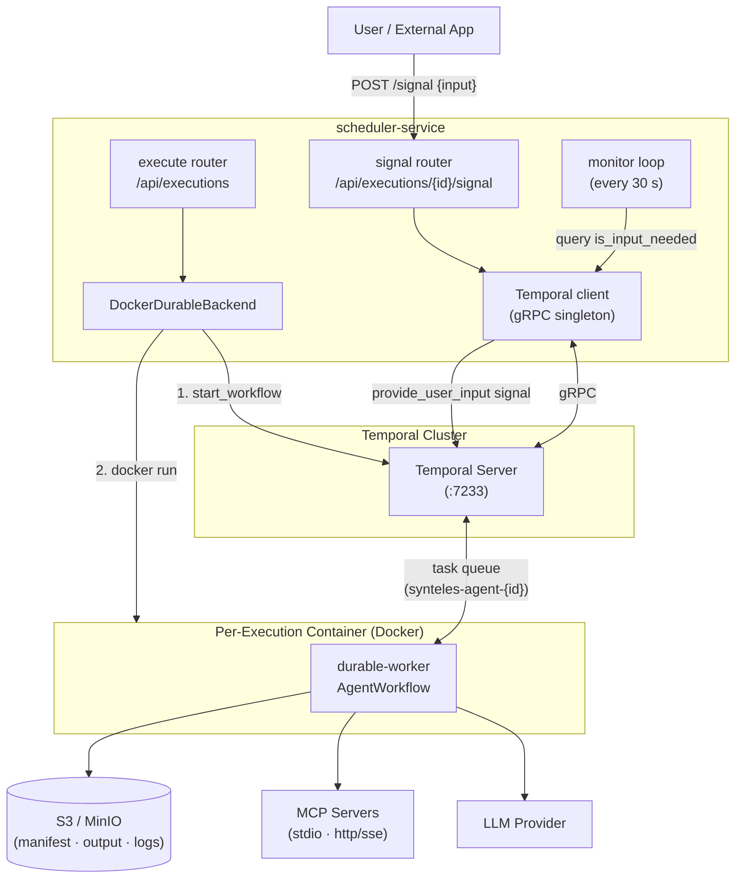
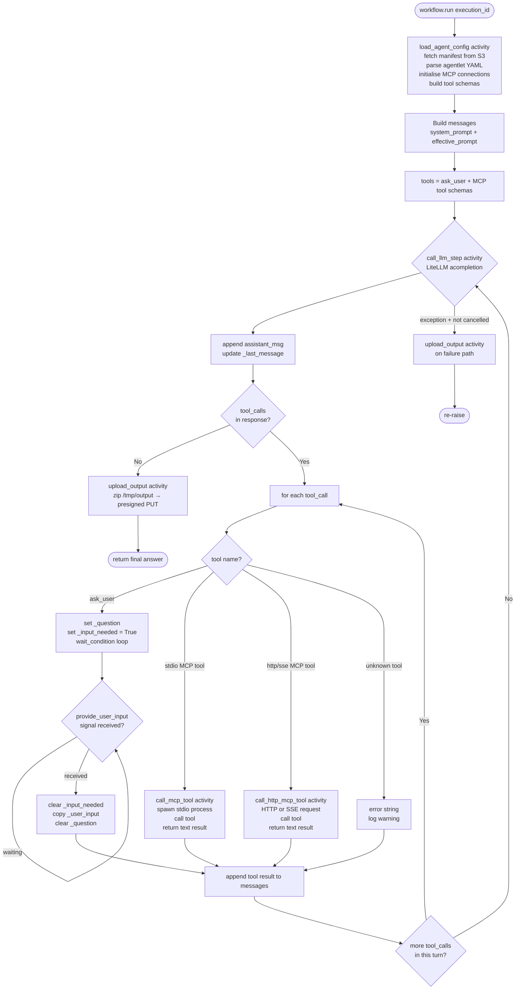
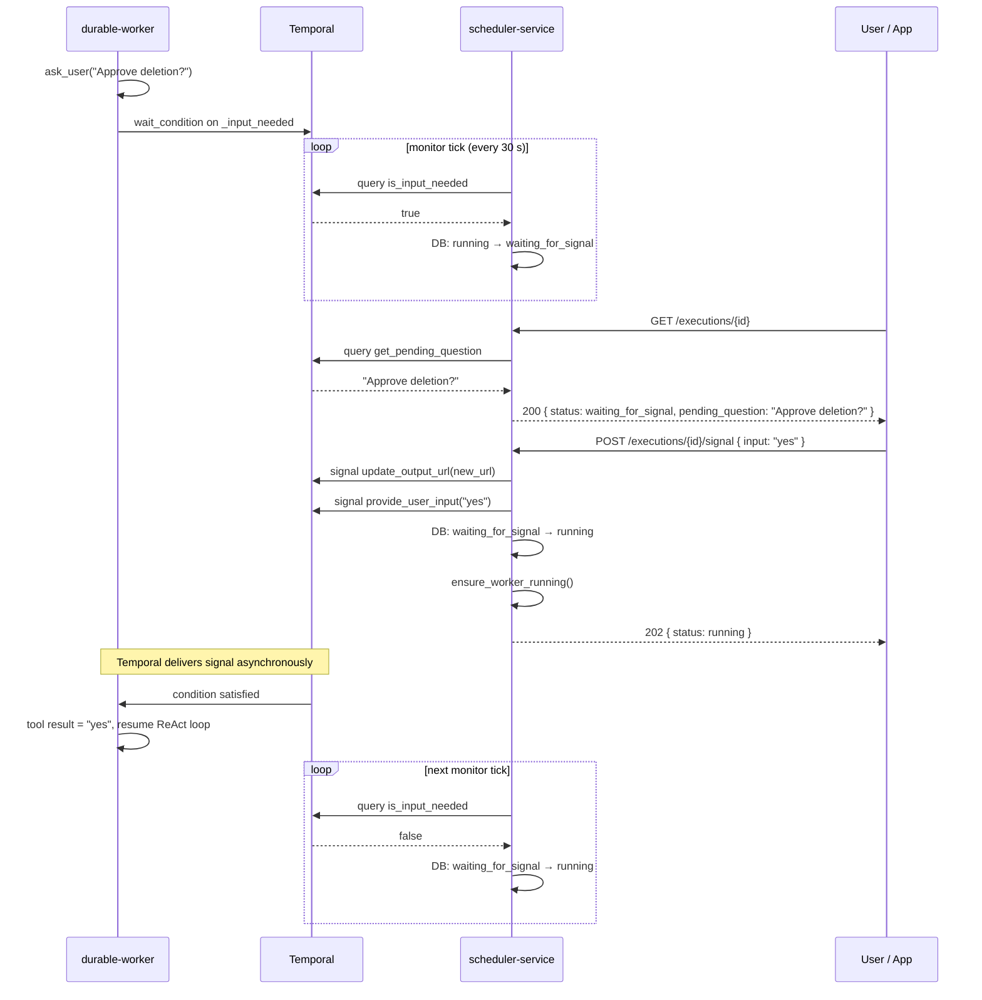
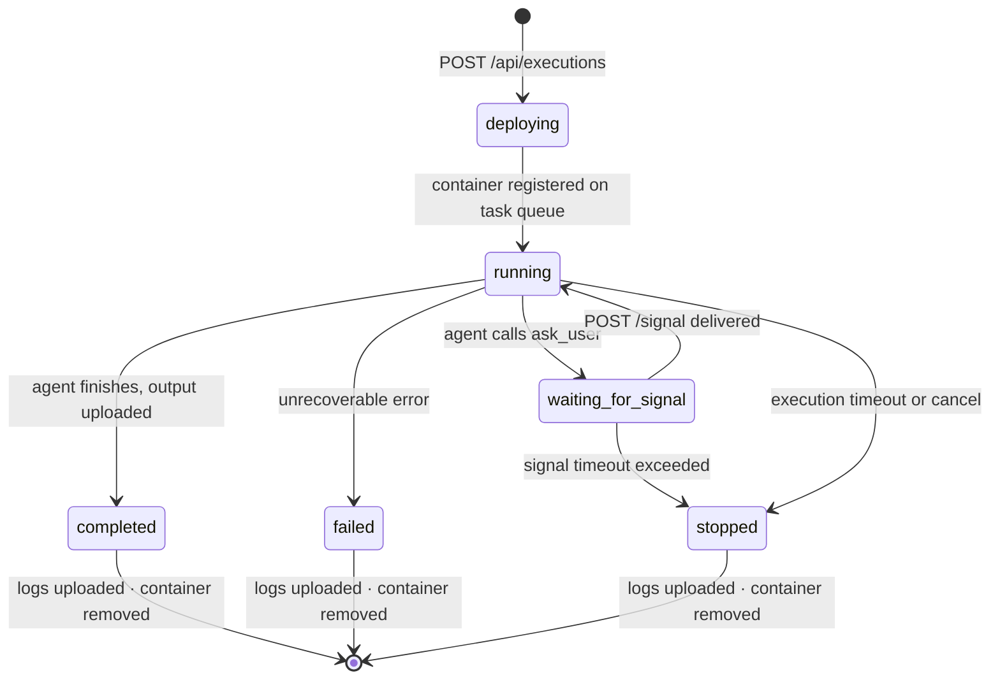

# Durable Execution

## Overview

Standard agentlets run as short-lived containers. The scheduler starts a Docker container, the agent executes, and the monitor records the result. There is no persistence: if the container crashes mid-run, the execution fails and must be restarted from scratch.

**Durable execution** wraps every agent run in a [Temporal](https://temporal.io) workflow. Temporal continuously journals the full execution history — every LLM call and tool result — to its own database. If the container crashes, the scheduler detects the failure, starts a new container, and Temporal replays the recorded history to bring the new worker back to exactly where it left off. Only the step in progress is retried; completed steps are not re-executed.

This design also enables **human-in-the-loop** (HITL) pauses. When an agent calls the `ask_user` tool, the workflow suspends and waits indefinitely for a human signal. The container can exit during the wait — when the user provides input via the API, the scheduler restarts the container if needed and delivers the signal to resume.

**Practical implications:**

- Long-running jobs can be interrupted (OOM, host maintenance, intentional pause) and resume without losing progress.
- Agents that require human approval or clarification before continuing do not need to re-run prior steps when the user responds.
- Temporal's workflow history provides a structured audit log of every activity, separate from container stdout logs.
- Standard executions remain available for short, stateless tasks where the overhead of a durable workflow is unnecessary.

| Capability | Standard | Durable |
|---|---|---|
| Crash recovery | Restart from scratch | Temporal replays history |
| Human-in-the-loop pause | No | Yes — `waiting_for_signal` |
| LLM provider | Via agentlet YAML / platform model | LiteLLM (`{provider}/{model_id}`) |
| Container lifetime | Short-lived, exits when done | Long-lived, polls Temporal task queue |
| `ask_user` tool | Not available | Pauses workflow; signal resumes it |
| `execution_backend` setting | `standard` | `durable` |

## Configuring a Durable Agentlet

### Setting execution_backend

Set `execution_backend` to `"durable"` when creating or updating an agentlet via the API:

```http
POST /api/agentlets
Content-Type: application/json

{
  "name": "my-durable-agent",
  "execution_backend": "durable",
  "agentlet_yaml": "..."
}
```

Or update an existing agentlet:

```http
PATCH /api/agentlets/{id}
Content-Type: application/json

{ "execution_backend": "durable" }
```

`execution_backend` is stored in the database and controls how all executions of that agentlet are run. It is not part of the agentlet YAML.

### Agentlet YAML

A complete durable agentlet YAML:

```yaml
system_prompt: |
  You are a data-processing assistant. Read input files from /tmp/input/.
  Write output files to /tmp/output/ — anything written there will be
  included in the output archive. Call ask_user when you need approval
  before an irreversible operation.

model:
  provider: anthropic
  model_id: claude-haiku-4-5

mcp_tools:
  - name: filesystem
    server: stdio
    command: uvx
    args:
      - mcp-server-filesystem
      - /tmp

secrets:
  - default   # injects platform model credentials into the container environment
```

Key YAML fields for durable agentlets:

| Field | Required | Description |
|---|---|---|
| `system_prompt` | Yes | Agent's system prompt. Instruct the agent to read from `/tmp/input/` and write to `/tmp/output/` as needed. |
| `model.provider` | Yes | LiteLLM provider string (e.g. `anthropic`, `openai`, `azure_ai`) |
| `model.model_id` | Yes | Model identifier as used by LiteLLM (e.g. `claude-haiku-4-5`, `gpt-4.1`) |
| `mcp_tools` | No | MCP server declarations — the only way to give tools to a durable agentlet beyond `ask_user` |
| `secrets` | No | `[default]` injects platform model credentials. Required when `model.provider` references a platform-managed credential. |

### File conventions

**Input files** from the execution request are downloaded to `/tmp/input/` at container startup. Reference them in your system prompt and make them accessible to MCP tools as needed.

**Output files** must be written to `/tmp/output/`. When execution completes, the `upload_output` activity zips everything under `/tmp/output/` and stores it as `output.zip` in S3. Files written anywhere else in the container are discarded when the container exits.

---

## Durable Execution Architecture



| Component | Description |
|---|---|
| **execute router** | Accepts `POST /api/executions`. Calls `DockerDurableBackend.submit()`, which registers the Temporal workflow first and then launches the per-execution container. |
| **signal router** | Accepts `POST /api/executions/{id}/signal`. Validates the execution is in `waiting_for_signal`, delivers the `update_output_url` and `provide_user_input` signals to Temporal, updates the DB status to `running`, then ensures the container is running. |
| **monitor loop** | Async background task polling every 30 s. Queries Temporal for `is_input_needed` to drive DB status transitions. Detects dead containers and restarts them. Finalises completed, failed, and timed-out executions. |
| **DockerDurableBackend** | Orchestrates two-step submission: starts the Temporal workflow before the container so history exists from the beginning, then runs the Docker container with the per-execution task queue name. |
| **Temporal client** | Shared gRPC singleton. One connection per scheduler-service process; reconnects transparently on drop. |
| **Temporal Server** | Persists the full workflow event history. Holds pending activity tasks until a worker registers on the matching task queue. Each execution gets an isolated queue (`synteles-agent-{id}`). |
| **durable-worker container** | One container per execution. Runs `AgentWorkflow` as a Temporal worker. Fetches the execution manifest from S3 at startup, initialises MCP server connections, registers on the per-execution task queue, and processes activity tasks. |
| **S3 / MinIO** | Stores the execution manifest (fetched by the container at startup), output artifacts (`output.zip` uploaded by the `upload_output` activity), and container logs (written on finalise). |
| **LLM Provider** | Called by the `call_llm_step` activity via LiteLLM. Provider and model are configured per agentlet in the YAML (`model.provider` / `model.model_id`). |
| **MCP Servers** | Tool providers declared in the agentlet YAML under `mcp_tools`. Supported transports: `stdio` (subprocess spawned inside the container) and `http`/`sse` (remote server). |

When a durable execution is submitted, `DockerDurableBackend` registers the Temporal workflow **before** starting the container. Temporal begins recording event history immediately, so if the container never boots, the execution still has a traceable record and Temporal's deadline mechanisms can act on it.

Each execution gets its own isolated task queue named `synteles-agent-{execution_id}`. The `execution_id` UUID is the single stable identifier across all three systems — it becomes the Temporal workflow ID, the container name, and the task queue name. No secondary lookups or string parsing are needed anywhere in the stack.

The container is stateless with respect to workflow progress. It is purely a Temporal activity runner: it registers on the task queue, executes activities (LLM calls, MCP tool invocations, output upload), and exits. All meaningful state — message history, position in the ReAct loop, HITL pause flags — lives in Temporal's event log. When the container crashes, the monitor detects it on the next poll and starts a fresh one. The new container re-registers on the same queue and Temporal dispatches the pending activity to it. From Temporal's perspective, a container restart is just a slow activity retry.

Status synchronisation uses a monitor-pull model rather than callbacks from the container. The monitor — an async background loop in `scheduler-service` — polls Temporal every 30 seconds and writes the result to the platform database. The container needs no credentials to the scheduler and no knowledge of platform internals. All status authority stays in one place.

HITL follows the same pull pattern. When the monitor reads `is_input_needed = true`, it transitions the execution to `waiting_for_signal`. When a signal is submitted via the API, the scheduler optimistically flips the status back to `running` in the 202 response rather than waiting for the next monitor tick — this keeps the UI responsive. Temporal confirms actual state on the following poll.

LiteLLM is used inside the container rather than a provider-specific SDK. The model string (`{provider}/{model_id}`) routes to the correct backend, and credentials are injected via the container environment at launch. Durable agentlets are provider-agnostic by the same mechanism standard agentlets use — no separate credential handling per execution type.

## ReAct Loop Implementation

The workflow implements a manual ReAct (Reason + Act) loop. **Every non-deterministic operation is a Temporal activity** so the workflow history can be replayed correctly after a container crash.



### MCP Servers

Two transport types are supported.

**stdio** — the MCP server is spawned as a child process inside the container for each `call_mcp_tool` activity invocation:

```yaml
mcp_tools:
  - name: web-search
    server: stdio
    command: uvx
    args:
      - tavily-mcp
    env:
      TAVILY_API_KEY: "sk-..."   # static env override applied at spawn time
```

**http / sse** — the MCP server runs externally; the container connects to it over HTTP or SSE via the `call_http_mcp_tool` activity:

```yaml
mcp_tools:
  - name: database-reader
    server: http          # or: sse
    url: https://mcp.example.com/mcp
    headers:
      X-Custom-Header: value
    api_key_env: DB_MCP_API_KEY   # env var name whose value becomes the Bearer token
```

Field reference:

| Field | Transport | Required | Description |
|---|---|---|---|
| `name` | both | Yes | Identifier used in tool routing and logs |
| `server` | both | Yes | `stdio`, `http`, or `sse` |
| `command` | stdio | Yes | Executable to spawn (e.g. `uvx`, `npx`, `python`) |
| `args` | stdio | No | CLI arguments passed to the command |
| `env` | stdio | No | Static env overrides applied when spawning the process |
| `url` | http/sse | Yes | MCP server base URL |
| `headers` | http/sse | No | HTTP headers included in every request |
| `api_key_env` | http/sse | No | Env var name whose value is sent as `Authorization: Bearer` |

Tool schemas are discovered at container startup via the MCP `initialize` + `list_tools` protocol, before the workflow begins processing. A server that fails to connect is skipped with a warning; the workflow continues without its tools. Schemas are loaded once and replayed deterministically from Temporal's event history — MCP servers are not re-queried on workflow replay after a container restart.

Secrets needed by MCP servers (API keys, tokens) can be injected into the container environment via the agentlet's `secrets` list — the scheduler resolves them from the user's stored secrets and populates the container's environment before start. For `stdio` tools, reference them in `env`; for `http`/`sse` tools, set `api_key_env` to the env var name.

## Human-in-the-Loop

A durable agentlet can pause mid-execution to ask the user a question and wait indefinitely for an answer before continuing. This is triggered when the agent calls the `ask_user` tool during the ReAct loop. The tool is injected automatically by the workflow — no configuration is required.

When `ask_user` fires:

1. The workflow suspends — the container blocks on an internal Temporal condition, holding the full conversation context in memory. The execution status transitions to `waiting_for_signal` on the next monitor poll (within 30 s).
2. Your application detects this by polling `GET /api/executions/{id}` (or `GET /api/public/executions/{id}`). When `status` is `waiting_for_signal`, the response also includes `pending_question` (the text the agent is asking) and `last_message` (the last assistant message, for context).
3. Submit the answer via `POST /api/executions/{id}/signal` with `{"input": "<answer>"}`. The platform refreshes the presigned output URL and delivers the signal to the Temporal workflow, then ensures the container is running (restarting it if it exited during the wait).
4. The workflow resumes — the agent receives the answer as the `ask_user` tool result and the ReAct loop continues from exactly where it paused.

There is no push mechanism. Your application must poll the status endpoint to detect when input is needed.

If no signal is delivered within `SIGNAL_WAIT_TIMEOUT_SECONDS` (default 24 h), the monitor transitions the execution to `stopped`.




## Durable Worker Lifecycle

The platform tracks a durable execution through two systems in parallel: the Temporal workflow (which holds the full event history) and the execution `status` in the platform database (which your application reads via the API). The monitor keeps them in sync by polling Temporal every 30 seconds.

### Execution Statuses

| Status | What it means |
|---|---|
| `deploying` | Execution accepted; Temporal workflow registered; container starting |
| `running` | Container is up and the ReAct loop is active |
| `waiting_for_signal` | Agent paused on `ask_user` — waiting for a human response via `POST /signal` |
| `completed` | Agent finished and output uploaded; container stopped and removed |
| `failed` | Unrecoverable error; logs available; container stopped and removed |
| `stopped` | Cancelled, timed out, or signal wait deadline passed; container stopped and removed |

### State Machine



All three terminal states go through the same cleanup step: container logs are uploaded to S3, the container is stopped and removed, and the Temporal workflow is cancelled if still open. Standard executions follow the same path without `waiting_for_signal`: `deploying → running → completed / failed / stopped`.

### Container Crash Recovery

The durable-worker container holds no durable state — all execution history lives in Temporal. If the container exits unexpectedly (OOM, host maintenance, or any other reason), the Temporal workflow keeps running. On the next monitor tick, the platform detects the dead container and starts a fresh one. The new container registers on the same per-execution task queue, Temporal replays history to the point of failure, and execution continues. The status remains `running` throughout — no action is needed from your application.

Container restarts are triggered in two situations:

| When | Trigger |
|---|---|
| Monitor tick | Container has exited while the Temporal workflow is still running |
| Signal delivery | Container may have exited during a `waiting_for_signal` pause; the scheduler ensures it is running before delivering the signal |

On each restart, fresh presigned S3 URLs are generated and the workflow is updated via a Temporal signal so expired URLs are never used.

### Timeouts

Two independent deadlines apply to a durable execution:

| Timeout | Set by | Default | Effect |
|---|---|---|---|
| Execution deadline | `timeout` in the API request (seconds) | 3600 s | Execution is stopped when the wall-clock deadline is reached |
| Signal wait deadline | `SIGNAL_WAIT_TIMEOUT_SECONDS` env var | 86400 s (24 h) | If `waiting_for_signal` persists past this limit, execution is stopped |

## Durable Execution API

### Signal Endpoints

| Method | Path | Auth | Status | Description |
|---|---|---|---|---|
| `POST` | `/api/executions/{id}/signal` | Bearer JWT | 202 | Deliver user input to a paused durable workflow |
| `POST` | `/api/public/executions/{id}/signal` | X-API-Key | 202 | Same, for external API callers |

**Request body:** `{ "input": "<user answer>" }`

**Response (202):** `{ "status": "running", … }` — optimistic DB flip to `running` before Temporal confirms.

**Error responses:**

| Code | Condition |
|---|---|
| 404 | Execution not found |
| 409 | See conditions below |
| 500 | Temporal RPC failure |

**409 conditions:**

| Condition | Reason |
|---|---|
| `execution_type != durable` | Standard executions have no Temporal workflow to signal |
| `status != waiting_for_signal` | Delivering a signal to a running execution would corrupt the message loop |
| `workflow_id IS NULL` | No Temporal handle to address; execution may have failed to start |

### Enriched Status Response

`GET /api/executions/{id}` and `GET /api/public/executions/{id}` include:

| Field | When present | Source |
|---|---|---|
| `pending_question` | `status == waiting_for_signal` | Temporal `get_pending_question` query |
| `last_message` | Always for durable (when available) | Temporal `get_last_message` query |
| `execution_type` | Always | DB column |

### Agentlet Endpoints (core-service)

`POST /api/agentlets`, `GET /api/agentlets`, `GET /api/agentlets/{id}`, `PATCH /api/agentlets/{id}` accept and return `execution_backend: "standard" | "durable"`.

---

## Known Issues and Limitations

**Output must be written to `/tmp/output/`.** Files created anywhere else in the container filesystem are discarded when the container exits. Input files from the execution request are made available at `/tmp/input/` at startup.

**No built-in platform tools.** Durable agentlets do not have access to the built-in tools available in standard agentlets. All tool capabilities must be declared via MCP servers in the agentlet YAML. The only automatically available tool is `ask_user`, which is injected by the workflow and requires no configuration.

**Status transitions are not instant.** The execution status in the API is updated by the monitor, which polls Temporal every 30 seconds. A workflow that has just paused on `ask_user` will not appear as `waiting_for_signal` in `GET /executions/{id}` until the next monitor tick. The same lag applies to completion and failure detection.

**Tool calls are processed sequentially.** All tool calls within a single LLM response are executed one at a time in the order returned. If the LLM includes `ask_user` alongside other tool calls in the same turn, the remaining calls are blocked until the user responds.

**No sub-agentlet orchestration.** Durable agentlets cannot launch or coordinate other agentlets. For workflows that require multi-agentlet coordination, use standard execution.

**No real-time log streaming.** Container logs are uploaded to S3 only when the execution reaches a terminal state (completed, failed, or stopped). There is no mechanism to stream live output from a running durable execution.

**Signal wait is bounded.** A `waiting_for_signal` execution that receives no response within `SIGNAL_WAIT_TIMEOUT_SECONDS` (default 24 h) is automatically stopped. See [Durable Worker Lifecycle](#durable-worker-lifecycle) for timeout configuration.
